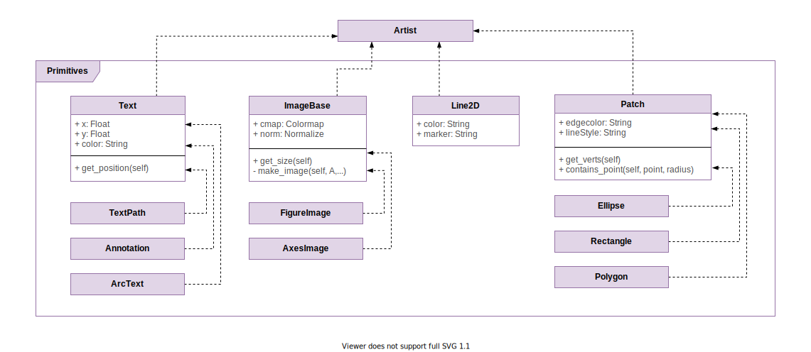
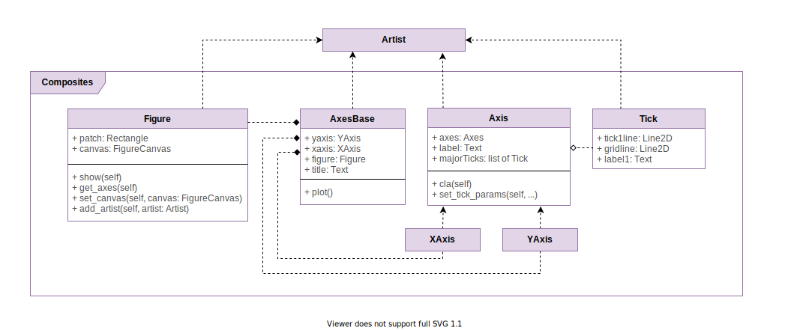

# Artist Layer

The Artist Layer defines modular visual components that are used in Figures.

`Artist`: this serves as the parent class of all artists. The code resides [here](https://github.com/matplotlib/matplotlib/blob/master/lib/matplotlib/artist.py). The coupling between the Artist layer and the Backend layer happen through the draw method in which the `Artist` object uses the `renderer` (an implementation of `RendererBase`) to draw on the `FigureCanvas`. The `Artist` will relate its coordinate system with the canvas’ and indicate where the object can be drawn. It converts the abstract representation of the object to an actual drawing for the user. 

There are both primitive and composite implementations of `Artist` classes.

## Primitives

Primitives can stand on their own in figures, or they can also be part of composites.

- `Line2D` resides in [lines.py](https://github.com/matplotlib/matplotlib/blob/master/lib/matplotlib/lines.py). They define lines and their various styles.
- Shape classes reside in [patches.py](https://github.com/matplotlib/matplotlib/blob/master/lib/matplotlib/patches.py). There are shapes such as `Rectangle`, `Polygon`, `Circle`, `Ellipse`, which have an abstract base class `Patch`.
- Text classes reside in [text.py](https://github.com/matplotlib/matplotlib/blob/master/lib/matplotlib/text.py). There are texts such as `ArcText`, `Annotation`, and `TextPath`, which have an abstract base class `Text`.
- Image classes reside in [image.py](https://github.com/matplotlib/matplotlib/blob/master/lib/matplotlib/image.py). There are images such as `AxesImage` and `FigureImage`, which have an abstract base class `ImageBase`.

## Composites

Composites can contain other composite objects, or primitive objects.

- `XAxis`, and `Yaxis`, which have a base class `Axis`. These reside in [axis.py](https://github.com/matplotlib/matplotlib/blob/master/lib/matplotlib/axis.py).
- `Tick` (which are contained in `Axis`) are also found in [axis.py](https://github.com/matplotlib/matplotlib/blob/master/lib/matplotlib/axis.py).
- `AxesBase` is composed of most other `Artist` objects such as `Line2D`, `Text`, `Axis` (`YAxis` and `XAxis`), and `Patch`. The base class for `Axes`, and its implementations are found in [/axes](https://github.com/matplotlib/matplotlib/blob/master/lib/matplotlib/axes)
- `Figure` resides in [figure.py](https://github.com/matplotlib/matplotlib/blob/master/lib/matplotlib/figure.py). It serves as a top-level container for all plot elements. A `Figure` instance contains a reference to the canvas (`FigureCanvas`) on which it is rendered.

