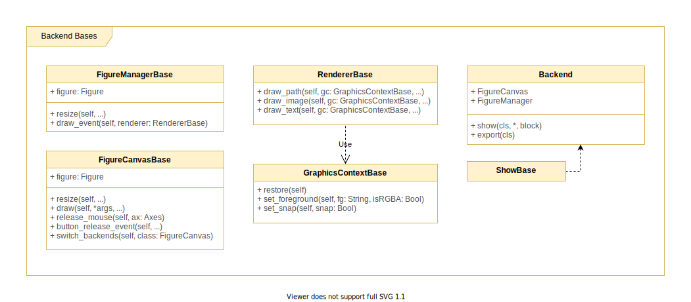
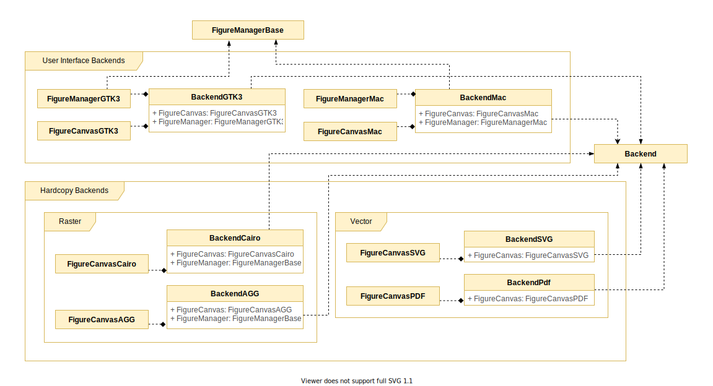
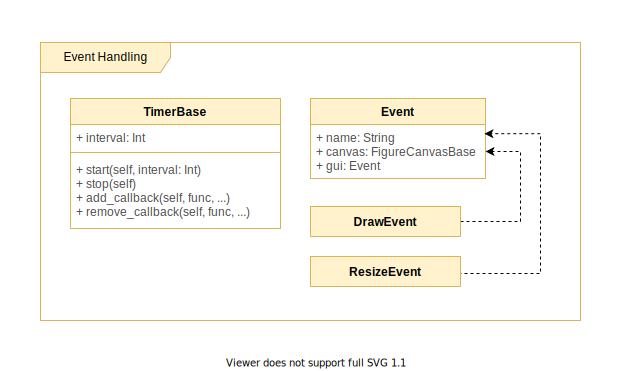

# Backend Layer

## Backend Base Classes

Abstract classes for most backend implementations are found in [backend_bases.py](https://github.com/matplotlib/matplotlib/blob/master/lib/matplotlib/backend_bases.py). 

Both interactive and non-interactive backend implementations implement the following base classes:

- `FigureCanvasBase`: the area (canvas) on which the `Figure` is rendered. This class holds a reference to a `Figure`, and is responsible for giving a `Figure` a reference to it’s canvas. This class also defines methods to draw and render the `Figure`. Some of the methods provided: 
  - `resize(self, ...)`
  - `switch_backends(self, class)`
- `RendererBase`: renders the `FigureCanvas`. The renderer handles drawing operations (for the `Figure`). Many of the rendering operations are handed off to `GraphicsContextBase`. Some of the methods provided:
  - `draw_path(self, gc, ...)`
  - `draw_text(self, gc, ...)`
  - `draw_image(self, gc, ...)`
- `GraphicsContextBase`: An additional abstraction to handle colour and line styles, and blending properties. Some of the methods provided:
  - `restore(self)`
  - `set_foreground(self, fg, isRGBA, ...)`
  - `set_snap(self, snap)`
- `Backend`: An abstract base class that is implemented by each of the backends, such as `backendPdf`, `backendSVG`, among others. Some of the methods provided:
  - `show(cls, *, block)`
  - `export(cls)`

## Backend Implementations

There are interactive (user-interface) backends, and non-interactive (hard copy) backend implementations. These implementations reside in [/backends](https://github.com/matplotlib/matplotlib/blob/master/lib/matplotlib/backends).

### User Interface Backends

These backends support rendering for user interfaces of applications. 

- `BackendGTK3`, which contains `FigureManagerGTK3` and `FigureCanvasGTK3` (implementations of `FigureManagerBase`, and `FigureCanvasBase`, respectively). 
- `BackendMac`, which contains `FigureManagerMac` and `FigureCanvasMac` (implementations of `FigureManagerMac`, and `FigureCanvasBase`, respectively). 

### Hard Copy Backends

These backends support rendering for standalone files such as PDF. Hard copy backends are further categorized to Raster, and Vector.

### Raster

- `BackendCairo`, which contains `FigureCanvasCairo` (an implementation of `FigureCanvasBase`). 
- `BackendAGG`, which contains `FigureCanvasAGG` (an implementation of `FigureCanvasBase`). 

### Vector

- `BackendSVG`, which contains `FigureCanvasSVG` (an implementation of `FigureCanvasBase`). 
- `BackendPdf`, which contains `FigureCanvasPdf` (an implementation of `FigureCanvasBase`). 

## Event Handling

The Backend Layer also provides classes that support event handling.

- Events such as `MouseEvent`, `ResizeEvent`, and `DrawEvent`, which have a base class `Event`. Different event classes are responsible for handling user input, such as keyboard strokes and mouse movement.
- `TimerBase` supports event timing and callbacks through methods such as `start(stop, interval)`, `stop(self)`, and `add_callback(self, func, ...)`, and `remove_callback(self, func, ...)`.

