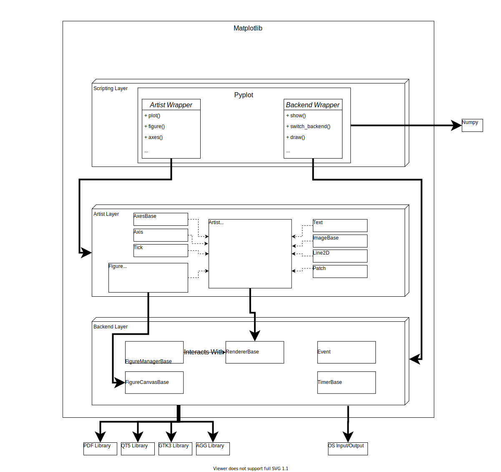

# Deliverable 2

Handout: https://www.utsc.utoronto.ca/~atafliovich/cscd01/project/deliverable1.pdf

## Architecture Analysis

Documentation [source available here](https://github.com/matplotlib/matplotlib/tree/master/doc) and [hosted here](https://matplotlib.org/3.1.1/contents.html).

Primarily, matplotlib is a library, whose `import`able elements are under the [matplotlib](https://github.com/matplotlib/matplotlib/tree/master/lib/matplotlib) module.

### The 3-tiered Architecture

The current architecture of matplotlib is based around creating, rendering, and updating `Figure` objects. It consists of three stacked up layers. The **encapsulation** of Matplotlib is in such a way that each layer in the stack is only aware of and interacts with lower levels which results in an appropriate distribution of complexity. Each layer is responsible for a particular functionality such as event-based interactions, visual component abstraction and creation, programmatic manipulation. 

### Backend Layer

For a full breakdown of the backend's structure: [details](./backend.md)

The lowest level in the stack of layers. It is responsible for encapsulating the canvas that is being drawn on, implementing the drawing on the canvas. 

Through the backend layer, Figures can be displayed (on the canvas). It is a layer of abstraction over components that can render a Figure. This layer is also responsible for handling event-based interactions (interacting with figures through keyboard and mouse inputs). There are interactive (user-interface) backends, and also non-interactive (hard copy) backends.

### Artist Layer

For a full breakdown of the artist layer's structure: [details](./artists.md)

The middle layer of Matplotlib's architecture. This layer's main responsibility is the abstraction of all visual components.  The artist layer mainly interacts with the Backend layer through the `draw()` method that is implemented by all the classes in the Artist layer. There is one main class `Artist`, and various implementations in two categories: Primitive, and Composite.

### Scripting Layer

This layer is a wrapper around the Artist and Backend layers. For a full breakdown of the scripting layer's structure: [details](./scripting.md)

The highest level of the stack. This layer provides a simple and clean scripting interface to allow programmatic manipulation of visual components. The Scripting layer has wrappers for the Backend Layer classes/functionalities, similarly for the Artist Layer whose methods interact with the corresponding layer.

The purpose of the scripting layer is to provide ease of use during interactive sessions with users, so that they can manipulate Figure objects indirectly. This is typically meant for data visualization purposes where the user does not need the full power of the artists' API.

## Software Development Process

## Specifics of Matplotlib development

- Matplotlib was released in 2003, so its feature set and scope are well established
- It is embedded in servers and applications, so it is important that breaking changes are rare
- There is a pre-existing test framework and expectation that new code be well-tested, too

## Processes considered

- ~~Agile~~
- Kanban
- RUP
- ~~Scrum~~
- Spiral (Risk Analysis)
- Waterfall
- XP

## Our choice

TODO
