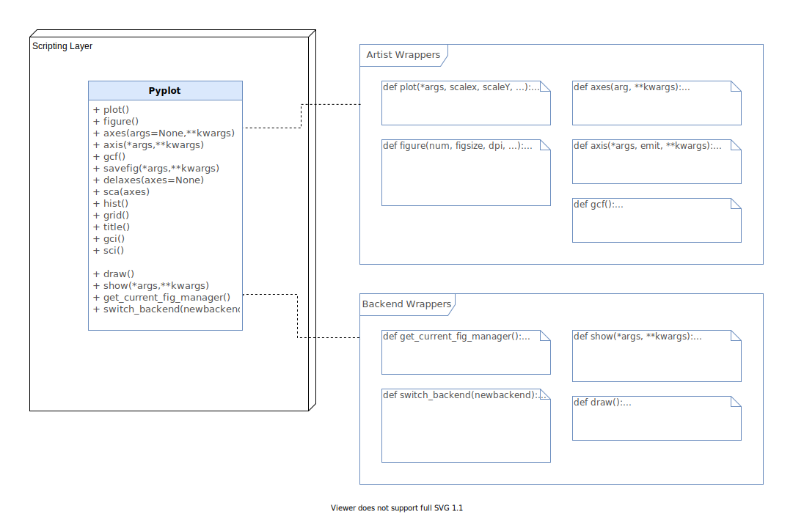

# Scripting Layer

## Pyplot Interface

Pyplot allows the Scripting Layer to act as a wrapper of the Artist and Backend Layers, where the implementation of these functions occur. Pyplot is the user interface to simplify the task of working with the other two layers.

The user can either work with the Artist and Backend Layers directly or use the Scripting Layer instead, where they do not need to initialize figures or specify their preferred backend. Pyplot will select the default backend (or the previously configured one) and call a `setup()` method that will initialize the appropriate objects needed given the selected backend (interactive or hardcopy) .

The pyplot interface provides the following functions (non-exhaustive) to manage the components returned by the `setup()` method’.

### Artist Layer wrappers

- `plot()`: calls the current `Figure`’s Axes object’s `plot()` method and the `draw()` method of the `FigureCanvas`
- `figure()`: creates or activates a new `Figure`
- `savefig()`: saves the current `Figure`
- `axes()`: adds an `Axes` to the current `Figure` and makes it the current `Axes`
- `gcf()`: returns the current `Figure`
- `sca(Axes ax)`: sets the current `Axes` to `ax` and the current `Figure` to the parent of `ax`

### Backend Layer wrappers
- `draw()`: redraws the current `Figure`
- `get_current_fig_manager()`: returns the current  `FigureManager`
- `switch_backend()`: allows the user to change the selected backend.
- `show()`: displays all figures.

