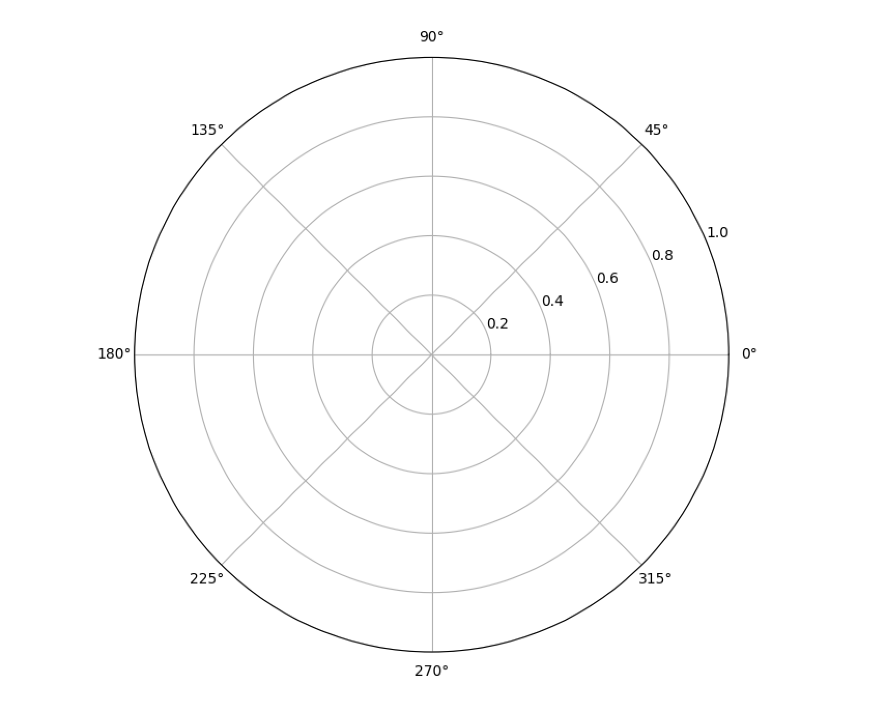

# [Issue 1460](https://github.com/matplotlib/matplotlib/issues/1460)

make subplots smarter with regards to subplot_kw and figure_kw

----------------------------------------------------

This is a: **New Feature**.

## Description

This issue is about the unnecessary use of  dictionaries when calling [`pyplot.subplots()`](https://github.com/CSCD01-team04/matplotlib/blob/master/lib/matplotlib/pyplot.py#L1034). 
Here is an example that demonstrates under the current implementation how [`pyplot.subplots()`](https://github.com/CSCD01-team04/matplotlib/blob/master/lib/matplotlib/pyplot.py#L1034) is supposed to be called: 
``` 
fig, axs = plt.subplots(2, 2, subplot_kw=dict(polar=True))
```

However, a more elegant way of calling would be something similar to the following: 
``` 
fig, axs = plt.subplots(2, 2, polar=True) 
```

## Location in code
Currently, [`pyplot.subplots()`](https://github.com/CSCD01-team04/matplotlib/blob/master/lib/matplotlib/pyplot.py#L1034) takes in a dictionary of subplot keywords and passes it to [`Figure.subplots()`](https://github.com/CSCD01-team04/matplotlib/blob/master/lib/matplotlib/figure.py#L1406). After, [`Figure.subplots()`](https://github.com/CSCD01-team04/matplotlib/blob/master/lib/matplotlib/figure.py#L1406) calls [`Figure.add_subplot()`](https://github.com/CSCD01-team04/matplotlib/blob/master/lib/matplotlib/figure.py#L1244) with those keywords. Based on the documentation of [`Figure.add_subplot()`](https://github.com/CSCD01-team04/matplotlib/blob/master/lib/matplotlib/figure.py#L1244), these subplot keywords consist of the following:
* `projection` : `{None, 'aitoff', 'hammer', 'lambert', 'mollweide', 'polar', 'rectilinear', str}, optional`
* `polar` : `bool, default: False`
* `sharex, sharey : ~.axes.Axes, optional`
* `label : str`

## Time Estimate
4 hours

## Design Choices
Currently, if [`pyplot.subplots()`](https://github.com/CSCD01-team04/matplotlib/blob/master/lib/matplotlib/pyplot.py#L1034) is called with any additional arguments, those arguments are passed to the [`Figure`](https://github.com/CSCD01-team04/matplotlib/blob/master/lib/matplotlib/figure.py) initializer. Since the figure keywords and subplot keywords are unambigiously named and cannot be mistaken with one another, we can pass all the additional arguments of [`pyplot.subplots()`](https://github.com/CSCD01-team04/matplotlib/blob/master/lib/matplotlib/pyplot.py#L1034) into [`Figure.subplots()`](https://github.com/CSCD01-team04/matplotlib/blob/master/lib/matplotlib/figure.py#L1406) and only extract the keywords that are related to subplots and pass them to [`Figure.add_subplot()`](https://github.com/CSCD01-team04/matplotlib/blob/master/lib/matplotlib/figure.py#L1244).

The changes are as follows.

Change the method signature in [`pyplot.subplots()`](https://github.com/CSCD01-team04/matplotlib/blob/master/lib/matplotlib/pyplot.py#L1034) and rename the `**fig_kw` parameter to `**kwargs`.
Currently, the method signature is:
```
def subplots(nrows=1, ncols=1, sharex=False, sharey=False, squeeze=True, 
             subplot_kw=None, gridspec_kw=None, **fig_kw)
```
Then, change the following line to represent the variable name change from `**fig_kw` to `**kwargs`. However the functionality of this line does not change. Currently, the line is:
```
fig = figure(**kwargs)
```
If `subplot_kw` is `None`, then extract the following values {`projection`, `polar`, `sharex`, `label`} from `**kwargs` dictionary and pass them to [`Figure.subplots()`](https://github.com/CSCD01-team04/matplotlib/blob/master/lib/matplotlib/figure.py#L1406)

Lastly, change the following function signature to represent the variable name change.
```
axs = fig.subplots(nrows=nrows, ncols=ncols, sharex=sharex, sharey=sharey 
                   squeeze=squeeze, subplot_kw=None, 
                   gridspec_kw=gridspec_kw, **kwargs)
```

## Testing

### Unit Tests

Initially we realized there are two options to test this issue.
1. Call [`pyplot.subplots()`](https://github.com/CSCD01-team04/matplotlib/blob/master/lib/matplotlib/pyplot.py#L1034) once with `subplot_kw=dict(polar=True)` and once with `polar=True`. Then compare the two figures in order to see whether they are equal using `matplotlib.testing.decorators.check_figures_equal`.

The above option results in the following test:

```
@check_figures_equal()
def test_combine_subplot_kw_fig_kw(fig_test, fig_ref):
    fig_ref.subplots(2, 2, subplot_kw=dict(polar=True))
    fig_test.subplots(2, 2, polar=True)
```
However this results in the test creating an image with each of the figures temporarily and comparing the two, which is an unnecessary overhead. Instead we decided on using the second option to test the feature.

2. Call [`pyplot.subplots()`](https://github.com/CSCD01-team04/matplotlib/blob/master/lib/matplotlib/pyplot.py#L1034) with `polar=True`, and then check to see if this function call resulted in the axis being of type `PolarAxesSubplot`. 

The above option results in the following test:

```
def test_combine_subplot_kw_fig_kw_2():
    fig1,axs1=plt.subplots(2, 2, polar=True)
    assert type(axs1[0][0]).__name__=="PolarAxesSubplot"
```

The tests have been implemented in [test_subplots.py](https://github.com/CSCD01-team04/matplotlib/blob/master/lib/matplotlib/tests/test_subplots.py#L178) and pushed to branch `deliverable_2_1460` from the forked repository. By the time of this commit, this test is currently failing as the fix has not been implemented.

### User Acceptance Tests

To verify that the fix was properly implemented, the user should do the following in a python file to generate a subplot with `kwargs`.


1. Import `matplotlib` and `matplotlib.pyplot` libraries at the very top of the python file. For convenience, use `import matplotlib as mpl` and `import matplotlib.pyplot as plt`.
2. Initialize an object for `Figure` and `Axis` using `plt.subplots(figsize=(10,20), polar=True)`.
3. Display the graph with `plt.show()`. The drawn subplot should be polar and have a white background

```
import matplotlib as mpl
import matplotlib.pyplot as plt

figure, axis = plt.subplots(figsize=(10,20), polar=True) # Create the graph
plt.show() # Display the graph
```

Once this is done, run the code. It should display a graph that has a plot with a polar axis. The user should also be able to use any other subplot argument, like `plt.subplots(figsize=(10,20), projection='polar')`.



In order to make sure the fix is backwards compatible, the user should do the following in a python file to generate a subplot with ` 

1. Import `matplotlib` and `matplotlib.pyplot` libraries at the very top of the python file. For convenience, use `import matplotlib as mpl` and `import matplotlib.pyplot as plt`.
2. Initialize an object for `Figure` and `Axis` using `plt.subplots(figsize=(10,20), subplot_kw=dict(polar=True))`.
3. Display the graph with `plt.show()`. The drawn subplot should be polar and have a white background

```
import matplotlib as mpl
import matplotlib.pyplot as plt

figure, axis = plt.subplots(figsize=(10,20), subplot_kw=dict(polar=True)) # Create the graph
plt.show() # Display the graph
```

Once this is done, run the code. It should display a graph that has a plot with a polar axis, like the example above.

## Implementation

As mentioned in **Design Choices**, [`pyplot.subplots()`](https://github.com/CSCD01-team04/matplotlib/blob/master/lib/matplotlib/pyplot.py#L1034) method has been updated so that subplot arguments do not necessarily need to be passed in a dictionary. 

```
def subplots(nrows=1, ncols=1, sharex=False, sharey=False, squeeze=True,
             subplot_kw=None, gridspec_kw=None, **kwargs):
    if subplot_kw is None:
        subplot_kw = {}
        for arg in ["projection","polar","label"]:
            if (arg in kwargs):
                subplot_kw[arg]=kwargs[arg]
                kwargs.pop(arg)

    fig = figure(**kwargs)
    axs = fig.subplots(nrows=nrows, ncols=ncols, sharex=sharex, sharey=sharey,
                       squeeze=squeeze, subplot_kw=subplot_kw,
                       gridspec_kw=gridspec_kw)
    return fig, axs
```
We can verify that the newly introduced unit test now passes, by running the following command in our root folder of this repository.

```
pytest lib/matplotlib/tests/test_subplots.py
```

All test cases (unit test, and acceptance test) now pass.