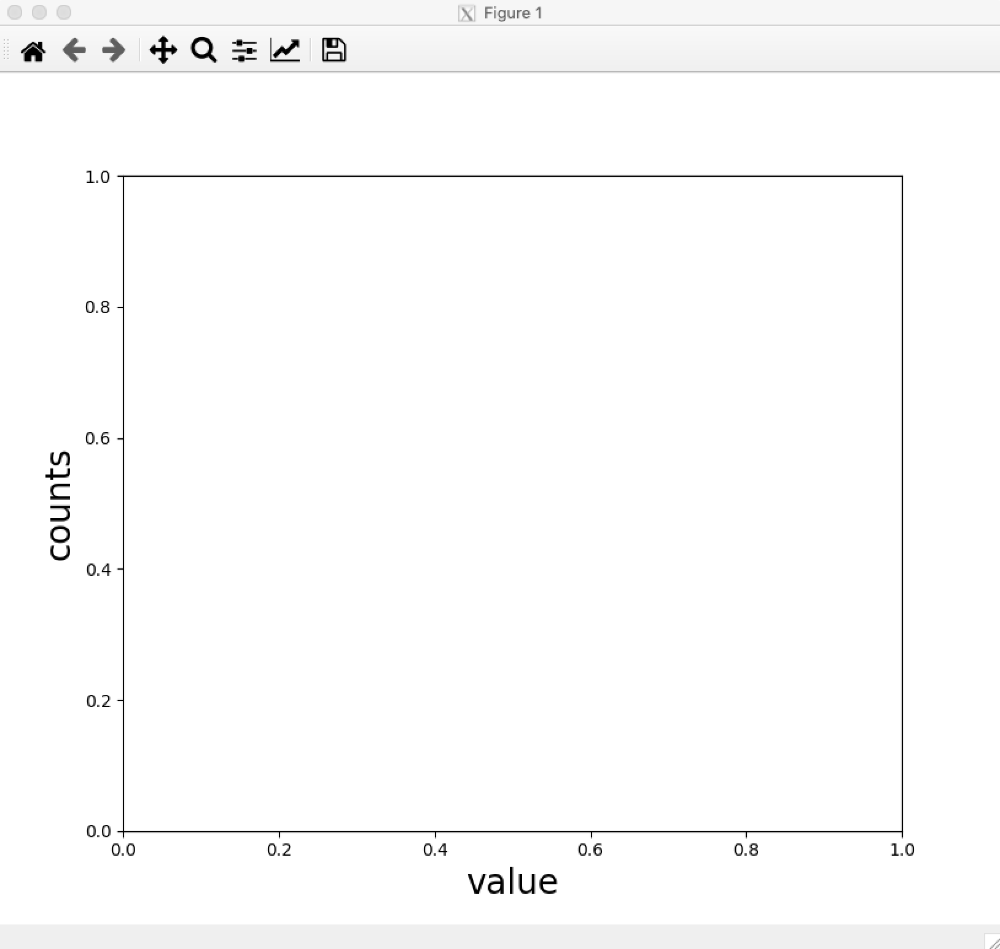

# [Issue 16389](https://github.com/matplotlib/matplotlib/issues/16389)

“Size” is ignored if placed before fontproperties.

----------------------------------------------------

This is a: **Bug**.

## Description
This issue is about inconsistency when specifying parameters to the `Text.update(...)` method. When parameters are passed in different orders, there are different behaviours seen. 

```
plt.xlabel("value", fontproperties='SimHei', size=20) # this will work

plt.ylabel("counts", size=20, fontproperties='SimHei') # this doesn't
```

In the first line, the `size` parameter will be honoured because it is passed after `fontproperties`. However, in the second line, the `size` parameter will be ignored. The above code will generate a plot with the x-axis label having a font size of 20, while the y-axis label has the default font size.


This is because one can also use `fontproperties` to set the font size, like so: `fontproperties = 'size=20'`. When `size` isn't given in `fontproperties`, then a default `size` will be created and applied, which overrides the initial (and explicit) `size` property applied beforehand! 

The expected behaviour is that both the x-axis and y-axis display the style properties applied on them.

One of the maintainers of matplotlib mentioned that `fontproperties` should have lower priority, because the parameter is passed as a string. On the other hand, the `size` parameter is considered more "explicit" and should have higher priority.

## Location in code

The [`pyplot.xlabel`](https://github.com/CSCD01-team04/matplotlib/blob/3205ff797038fb4662b843faceeaaec1f63acef9/lib/matplotlib/pyplot.py#L2901) and [`pyplot.ylabel`](https://github.com/CSCD01-team04/matplotlib/blob/3205ff797038fb4662b843faceeaaec1f63acef9/lib/matplotlib/pyplot.py#L2909) methods are wrappers around the `Axes` methods: `set_xlabel(...)` and `set_ylabel(...)` methods, respectively. Both the `size` and `fontproperties` parameters are handled in `**kwargs`.

```
def xlabel(xlabel, fontdict=None, labelpad=None, *, loc=None, **kwargs):
    return gca().set_xlabel(
        xlabel, fontdict=fontdict, labelpad=labelpad, loc=loc,
        **kwargs)
```

The `set_xlabel(...)` and `set_ylabel(...)` methods call the [`axis.set_label_text(...)`](https://github.com/CSCD01-team04/matplotlib/blob/3205ff797038fb4662b843faceeaaec1f63acef9/lib/matplotlib/axis.py#L1507) method, which calls the `Text.update(...)` function on the `**kwargs`. 

```
def set_label_text(self, label, fontdict=None, **kwargs):
    ...
    self.label.update(kwargs)
```

The issue lies in the [`Text.update(...)`](https://github.com/CSCD01-team04/matplotlib/blob/3205ff797038fb4662b843faceeaaec1f63acef9/lib/matplotlib/text.py#L175). Below is the method in question. We can see that each of the properties in the `kwargs` dictionary are passed into the `Artist.update` method.

```
def update(self, kwargs):
    # docstring inherited
    # Update bbox last, as it depends on font properties.
    sentinel = object()  # bbox can be None, so use another sentinel.
    bbox = kwargs.pop("bbox", sentinel)
    super().update(kwargs)
    if bbox is not sentinel:
        self.set_bbox(bbox)
```

The [`Artist.update`](https://github.com/CSCD01-team04/matplotlib/blob/3205ff797038fb4662b843faceeaaec1f63acef9/lib/matplotlib/artist.py#L968) method takes each of the items in `kwargs` and applies them one after the other. 

As mentioned previously, one can use `fontproperties` to set other font properties such as `family`, `size`, `variant`, `weight`, etc. When `fontproperties` is extracted from `kwargs`, a new [`FontProperties`](https://github.com/CSCD01-team04/matplotlib/blob/3205ff797038fb4662b843faceeaaec1f63acef9/lib/matplotlib/font_manager.py#L553))  instance is created with default values for all properties not provided. 

When `fontproperties` is supplied after a parameter like `size`, then `size` is overridden. 

## Time Estimate
4-6 hours

## Design Choices

Currently, `fontproperties` sets multiple properties with default values if they are not explicitly declared in `fontproperties`. 

One of the more ambitious fixes would be:
- Parse the properties set with `fontproperties`.
- For every property not set with `fontproperties` (that can be set with `fontproperties`), check if that property has been set explicitly beforehand.
    - If the property was previously unset, then set the default property.
    - If the property was set, then do not override it.

However, the more sensible fix was one proposed by a matplotlib maintainer. When looping through the keyword arguments `kwargs`, and updating each style property one after the other, `fontproperties` should be applied before all other properties. Of course, one of the possible problems with that is that a property set with `fontproperties` would be overridden by other properties kwargs.

```
plt.xlabel("value", size=20, fontproperties='size=30')
```

In the above example, the x-axis will have a title with a font size of `20`, instead of `30`. However, one of the maintainers brought up that the explicit keyword `size=20` should be honoured over `fontproperties='size=30'` because the property was given as a string. That being said, the changes would be applied to the method `Text.update(...)`:

- Extract the `fontproperties` property from `kwargs` first.
- Apply `fontproperties` with `Text.set_fontproperties`
- Call `Artist.update` on the rest of the `kwargs`

The other code in the method should remain as they are.

## Testing

The main issue here was that the `size` property would not be honoured when it was placed before `fontproperties`.  

### Unit Tests

It would be sufficient to test that any of the properties for `Text` explicitly set with `kwargs`, would be honoured over the same property set with `fontproperties`. For our unit test, we check that the `size` property will be honoured even if it is supplied before `fontproperties`. A new test method would be created in [`test_text.py`](https://github.com/CSCD01-team04/matplotlib/blob/master/lib/matplotlib/tests/test_text.py).

```
def test_fontproperties_update(): 
    plt.figure()
    ylabel = plt.ylabel("ylabel", fontproperties='Tahoma', size=20)    
    xlabel = plt.xlabel("xlabel", size=20, fontproperties='Tahoma')
    assert ylabel.get_size() == 20
    assert xlabel.get_size() == 20
```

The tests have been implemented in [test_text.py](https://github.com/CSCD01-team04/matplotlib/blob/master/lib/matplotlib/tests/test_text.py#L657) and pushed to branch `deliverable_2_16389` from the forked repository first, and then to `master` branch. By the time of this commit, this test is currently failing as the fix has not been implemented.

### User Acceptance Tests

To verify that the fix was properly implemented, the user should do the following in a python file to create a plot with properly styled x-axis and y-axis labels.
1. Import `matplotlib` and `matplotlib.pyplot` libraries at the very top of the python file. For convenience, use `import matplotlib as mpl` and `import matplotlib as plt`.
2. Apply styles to the x-axis label using `plt.xlabel("value", fontproperties='Tahoma', size=20)`, to apply a title of `"value"`, a font family of `'Tahoma'`, and a font size of `20`.
3. Similarly, apply styles to the y-axis label using `plt.xlabel("counts", size=20, fontproperties='Tahoma')`, to apply a title of `"counts"`, a font size of `20`, and a font family of `'Tahoma'`.
4. Finally, write `plt.show()` to display the graph.

```
import matplotlib.pyplot as plt
import matplotlib as mpl

plt.xlabel("value", fontproperties='Tahoma', size=20) # Style x-axis label.
plt.ylabel("counts", size=20, fontproperties='Tahoma') # Style y-axis label.
plt.show() # Display the graph.
```

The output should be a plot that has a x-axis title of `"value"`, and a y-axis title of `"counts"`. Both titles will have a font family of `'Tahoma'` (if the font exists. Otherwise it will default to another font), and a font size of `20`. 



## Implementation

As mentioned in **Design Choices**, the `Text.update(...)` method has been updated so that `fontproperties` is extracted and applied first, before all of other properties. The new method is like so.

```
def update(self, kwargs):
    # docstring inherited
    sentinel = object()  # bbox can be None, so use another sentinel.
    fontproperties = kwargs.pop("fontproperties", sentinel)
    # Update fontproperties first, to lower its priority.
    if fontproperties is not sentinel:
        self.set_fontproperties(fontproperties)
    # Update bbox last, as it depends on font properties.
    bbox = kwargs.pop("bbox", sentinel)
    super().update(kwargs)
    if bbox is not sentinel:
        self.set_bbox(bbox)
```

The method can be found at [text.py](https://github.com/CSCD01-team04/matplotlib/blob/master/lib/matplotlib/text.py#L175)

We can verify that the newly introduced unit test now passes, by running the following command in our root folder of this repository.
```
python3 -mpytest matplotlib
```
For convenience, we can directly run the unit tests for `Text`.
```
python3 -mpytest matplotlib/lib/matplotlib/tests/test_text.py
```
All test cases (unit test, and acceptance test) now pass.


