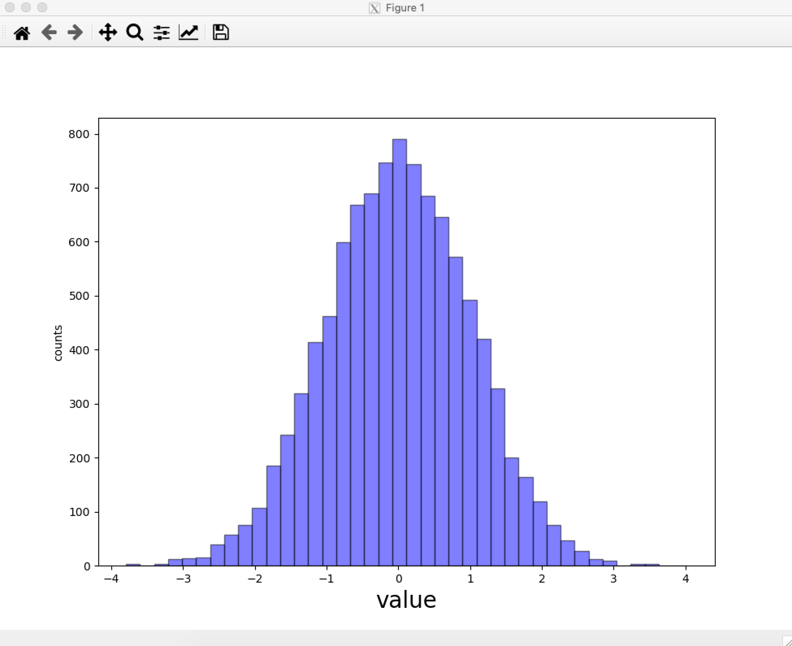

# [Issue 16389](https://github.com/matplotlib/matplotlib/issues/16389)

“Size” is ignored if placed before fontproperties.

----------------------------------------------------

This is a: **Bug**.

## Description
This issue is about inconsistency when specifying parameters to the `Text.update(...)` method. When parameters are passed in different orders, there are different behaviours seen. 

```
plt.xlabel("value", fontproperties='SimHei', size=20) # this will work

plt.ylabel("counts", size=20, fontproperties='SimHei')  # this doesn't
```

In the first line, the `size` parameter will be honoured because it is passed after `fontproperties`. However, in the second line, the `size` parameter will be ignored. The above code will generate a plot with the x-axis label having a font size of 20, while the y-axis label has the default font size.



This is because one can also use `fontproperties` to set the font size, like so: `fontproperties = 'size=20'`. When `size` isn't given in `fontproperties`, then a default `size` will be created and applied, which overrides the initial (and explicit) `size` property applied beforehand! 

The expected behaviour is that both the x-axis and y-axis display the style properties applied on them.

One of the maintainers of matplotlib mentioned that `fontproperties` should have lower priority, because the parameter is passed as a string. On the other hand, the `size` parameter is considered more "explicit" and should have higher priority.

## Location in code

The `pyplot.xlabel` and `pyplot.ylabel` methods are wrappers around the `Axes` methods: `set_xlabel(...)` (found at [pyplot.py#L2901](https://github.com/CSCD01-team04/matplotlib/blob/3205ff797038fb4662b843faceeaaec1f63acef9/lib/matplotlib/pyplot.py#L2901)) and `set_ylabel(...)` methods, respectively. Both the `size` and `fontproperties` parameters are handled in `**kwargs`.

```
def xlabel(xlabel, fontdict=None, labelpad=None, *, loc=None, **kwargs):
    return gca().set_xlabel(
        xlabel, fontdict=fontdict, labelpad=labelpad, loc=loc,
        **kwargs)
```

The `set_xlabel(...)` and `set_ylabel(...)` methods call the `axis.set_label_text(...)` method (found at [axis.py#L1507](https://github.com/CSCD01-team04/matplotlib/blob/3205ff797038fb4662b843faceeaaec1f63acef9/lib/matplotlib/axis.py#L1507)), which calls the `Text.update(...)` function on the `**kwargs`. 

```
def set_label_text(self, label, fontdict=None, **kwargs):
    ...
    self.label.update(kwargs)
```

The issue lies in the `Text.update(...)` (found at [text.py#L175](https://github.com/CSCD01-team04/matplotlib/blob/3205ff797038fb4662b843faceeaaec1f63acef9/lib/matplotlib/text.py#L175)). Below is the method in question. We can see that each of the properties in the `kwargs` dictionary are passed into the `Artist.update` method.

```
def update(self, kwargs):
    # docstring inherited
    # Update bbox last, as it depends on font properties.
    sentinel = object()  # bbox can be None, so use another sentinel.
    bbox = kwargs.pop("bbox", sentinel)
    super().update(kwargs)
    if bbox is not sentinel:
        self.set_bbox(bbox)
```

The `Artist.update` (found at [artist.py#L968](https://github.com/CSCD01-team04/matplotlib/blob/3205ff797038fb4662b843faceeaaec1f63acef9/lib/matplotlib/artist.py#L968)) method takes each of the items in `kwargs` and applies them one after the other. When `fontproperties` is supplied after a parameter like `size`, then `size` is overridden. 

## Time Estimate
X hours

## Code Changes

Pull request available [here]()

## Acceptance Tests
