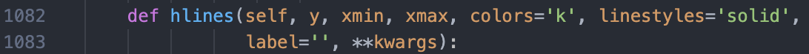
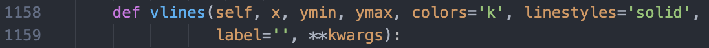
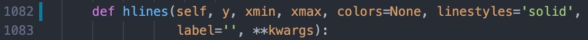
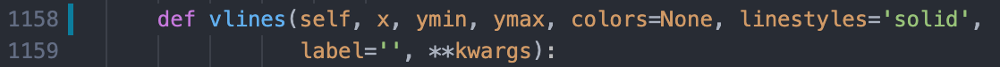

# [Issue 16482](https://github.com/matplotlib/matplotlib/issues/16482)

Pyplot hlines and vlines do not use the 'lines.color' property in rcParams by default

----------------------------------------------------

This is a: **Change Request**.

## Description

This issue is about the default value of the `colors` parameter in both `hlines` and `vlines`. Instead of using `k` as the default parameter for colour, it should try to get `lines.color` which is extracted from `rcParams`. If the `colors` parameter is specified as `None`, then the colour of the lines will be `lines.color`, however, if the `colors` parameter is not given, it will use the default value `k`.

## Location in code

The issue comes from Pyplot's `hlines` and `vlines` methods which are autogenerated by [boilerplate.py](https://github.com/matplotlib/matplotlib/blob/master/tools/boilerplate.py) using the `hlines` and `vlines` methods from the `Axes` class. This class is located [here](https://github.com/matplotlib/matplotlib/blob/master/lib/matplotlib/axes/_axes.py). The declaration of the `hlines` and `vlines` methods are in lines 1082 and 1158 respectively.

The changes need to be implemented in the `Axes` class only as the `hlines` and `vlines` in Pyplot methods will be regenerated based on the new implementation.

## Time Estimate

1-2 hours

## Code Changes

The default value of the `colors` parameter in both `hlines` and `vlines` needs to be changed so the new default value becomes `lines.color` from `rcParams`.

Pull request available [here]()

## Acceptance Tests
