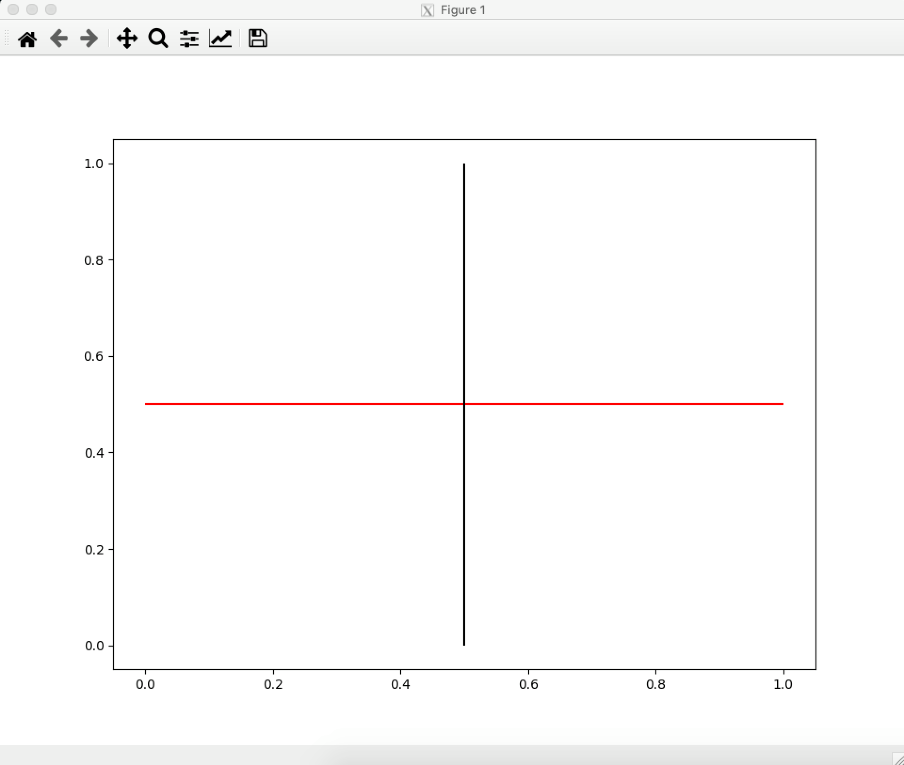

# [Issue 16482](https://github.com/matplotlib/matplotlib/issues/16482)

Pyplot hlines and vlines do not use the 'lines.color' property in rcParams by default

----------------------------------------------------

This is a: **Change Request**.

## Description

This issue is about the default value of the `colors` parameter in both `hlines` and `vlines` methods when plotting these lines. The methods are not checking if the `lines.color` parameter, which is found in `rcParams`, has been specified.

```
plt.figure({'lines.color':'red'})
with mpl.rc_context():
   plt.hlines(0.5, 0, 1, colors=None) # this will work
   plt.vlines(0.5, 0, 1) # this doesn't
```

If the `colors` parameter is specified as `None`, then the color of the lines will be `lines.color`. However, if the `colors` parameter is not given, then the default value `k` will be used, without checking for the `lines.color` property in `rcParams`.



The request is for `hlines` and `vlines` to use the `lines.color` property as default, instead of using `k`.

## Location in code

The issue comes from Pyplot's [`pyplot.hlines`](https://github.com/CSCD01-team04/matplotlib/blob/master/lib/matplotlib/pyplot.py#L2495) and [`pyplot.vlines`](https://github.com/CSCD01-team04/matplotlib/blob/master/lib/matplotlib/pyplot.py#L2865) methods which are autogenerated by [`boilerplate.py`](https://github.com/CSCD01-team04/matplotlib/blob/master/tools/boilerplate.py) using the `Axes.hlines` and `Axes.vlines` methods from the [`Axes`](https://github.com/CSCD01-team04/matplotlib/blob/master/lib/matplotlib/axes/_axes.py) class. 

```
# Autogenerated by boilerplate.py.  Do not edit as changes will be lost.
@docstring.copy(Axes.hlines)
def hlines(y, xmin, xmax, colors='k', linestyles='solid', label='', *,data=None, **kwargs):
```

```
# Autogenerated by boilerplate.py.  Do not edit as changes will be lost.
@docstring.copy(Axes.vlines)
def vlines( x, ymin, ymax, colors='k', linestyles='solid', label='', *, data=None, **kwargs):
```

The declaration of the [`Axes.hlines`](https://github.com/CSCD01-team04/matplotlib/blob/master/lib/matplotlib/axes/_axes.py#L1079) and [`Axes.vlines`]((https://github.com/CSCD01-team04/matplotlib/blob/master/lib/matplotlib/axes/_axes.py#L1155)) methods in the `Axes` class are shown below.

```
def hlines(self, y, xmin, xmax, colors='k', linestyles='solid', label='', **kwargs):
```

```
def vlines(self, x, ymin, ymax, colors='k', linestyles='solid', label='', **kwargs):
```

## Time Estimate

1-2 hours

## Design Choices

The default value of the `colors` parameter in both `hlines` and `vlines` needs to be changed so the new default value becomes `lines.color` from `rcParams`.

In the `__init__` method of the [`Line2D`](https://github.com/CSCD01-team04/matplotlib/blob/master/lib/matplotlib/lines.py#L268) class, all the default parameters of a `Line2D` are `None` including `color`. As shown in [lines.py#L321](https://github.com/CSCD01-team04/matplotlib/blob/master/lib/matplotlib/lines.py#L321), when `color` is None, it will change it to be `lines.color` from `rcParams`.

```
if color is None:
   color = rcParams['lines.color']
```

The `hlines` and `vlines` methods will pass their `colors` parameter to create a `Line2D`. If the default value of the `colors` parameter is changed to `None`, then the color of the line will be `lines.color`.

With this proposed solution, if both `colors` and `lines.colors` were not specified, the default value for `lines.color` will be used (blue).
