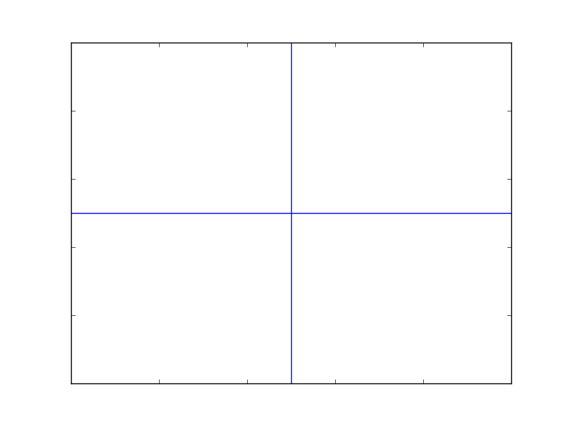
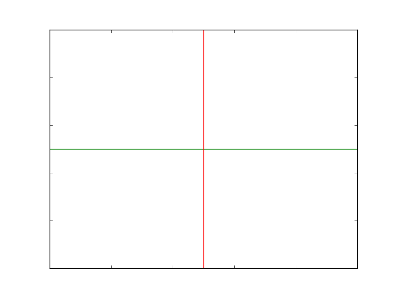

# [Issue 16482](https://github.com/matplotlib/matplotlib/issues/16482)

Pyplot hlines and vlines do not use the 'lines.color' property in rcParams by default

----------------------------------------------------

This is a: **Change Request**.

## Description

This issue is about the default value of the `colors` parameter in both `hlines` and `vlines` methods when plotting these lines. The methods are not checking if the `lines.color` parameter, which is found in `rcParams`, has been specified.

```
plt.figure({'lines.color':'red'})
with mpl.rc_context():
   plt.hlines(0.5, 0, 1, colors=None) # this will work
   plt.vlines(0.5, 0, 1) # this doesn't
```

If the `colors` parameter is specified as `None`, then the color of the lines will be `lines.color`. However, if the `colors` parameter is not given, then the default value `k` will be used, without checking for the `lines.color` property in `rcParams`.


The request is for `hlines` and `vlines` to use the `lines.color` property as default, instead of using `k`.

## Location in code

The issue comes from Pyplot's [`pyplot.hlines`](https://github.com/CSCD01-team04/matplotlib/blob/master/lib/matplotlib/pyplot.py#L2495) and [`pyplot.vlines`](https://github.com/CSCD01-team04/matplotlib/blob/master/lib/matplotlib/pyplot.py#L2865) methods which are autogenerated by [`boilerplate.py`](https://github.com/CSCD01-team04/matplotlib/blob/master/tools/boilerplate.py) using the `Axes.hlines` and `Axes.vlines` methods from the [`Axes`](https://github.com/CSCD01-team04/matplotlib/blob/master/lib/matplotlib/axes/_axes.py) class. 

```
# Autogenerated by boilerplate.py.  Do not edit as changes will be lost.
@docstring.copy(Axes.hlines)
def hlines(y, xmin, xmax, colors='k', linestyles='solid', label='', *,data=None, **kwargs):
```

```
# Autogenerated by boilerplate.py.  Do not edit as changes will be lost.
@docstring.copy(Axes.vlines)
def vlines( x, ymin, ymax, colors='k', linestyles='solid', label='', *, data=None, **kwargs):
```

The declaration of the [`Axes.hlines`](https://github.com/CSCD01-team04/matplotlib/blob/master/lib/matplotlib/axes/_axes.py#L1079) and [`Axes.vlines`]((https://github.com/CSCD01-team04/matplotlib/blob/master/lib/matplotlib/axes/_axes.py#L1155)) methods in the `Axes` class are shown below.

```
def hlines(self, y, xmin, xmax, colors='k', linestyles='solid', label='', **kwargs):
```

```
def vlines(self, x, ymin, ymax, colors='k', linestyles='solid', label='', **kwargs):
```

## Time Estimate

1-2 hours

## Design Choices

The default value of the `colors` parameter in both `hlines` and `vlines` needs to be changed so the new default value becomes `lines.color` from `rcParams`.

In the `__init__` method of the [`Line2D`](https://github.com/CSCD01-team04/matplotlib/blob/master/lib/matplotlib/lines.py#L268) class, all the default parameters of a `Line2D` are `None` including `color`. As shown in [lines.py#L321](https://github.com/CSCD01-team04/matplotlib/blob/master/lib/matplotlib/lines.py#L321), when `color` is None, it will change it to be `lines.color` from `rcParams`.

```
if color is None:
   color = rcParams['lines.color']
```

The `hlines` and `vlines` methods will pass their `colors` parameter to create a `Line2D`. If the default value of the `colors` parameter is changed to `None`, then the color of the line will be `lines.color`.

With this proposed solution, if both `colors` and `lines.colors` were not specified, the default value for `lines.color` will be used (blue).

## Testing

The main issue with the current implementation is that if the `colors` parameter in `Axes.hlines` or `Axes.vlines` was not explicitly set to `None`, then the methods would not retrieve the `rcParams` property: `lines.color`.

### Unit Tests

To check the new implementation, we should test that if neither the `lines.color` property in `rcParams`, nor the `colors` parameter in `Axes.hlines` or `Axes.vlines` have not been initialized, then the lines plotted should display the default colour of `lines.color`, which is `blue`. Similarly, if the `colors` parameter in `Axes.hlines` or `Axes.vlines` is explicitly set to `None`, it should have the same behaviour as if the parameter was not initialized.

```
@image_comparison(['vlines_hlines_colors.png'], remove_text=True)
def test_vlines_hlines_colors():
    fig = plt.figure()
    with matplotlib.rc_context():
        plt.hlines(0.5, 0, 1)
        plt.vlines(0.5, 0, 1, colors=None)
```
Moreover, when the `lines.color` property of `rcParams` is set, then if the `colors` parameter in `Axes.hlines` or `Axes.vlines` was not specified, the property in `lines.color` will be used when plotting the line. If the `color` parameter was explicitly set, then it will use the given colour.

```
@image_comparison(['vlines_hlines_diff_colors.png'], remove_text=True)
def test_vlines_hlines_diff_colors():
    fig = plt.figure()
    with matplotlib.rc_context({'lines.color':'red'}):
        plt.hlines(0.5, 0, 1, colors='green')
        plt.vlines(0.5, 0, 1)
```

The tests have been implemented in [test_lines.py](https://github.com/CSCD01-team04/matplotlib/blob/deliverable_2_16482/lib/matplotlib/tests/test_lines.py#L199) and pushed to branch `deliverable_2_16482` from the forked repository. By the time of this commit, both tests are currently failing as the fixes have not being implemented yet.

### User Acceptance Tests

To verify that the fix was properly implemented, the user should do the following in a python file to plot a horizontal and a vertical line which will get the default colors.

1. Import `matplotlib` and `matplotlib.pyplot` libraries at the very top of the python file. For convenience, use `import matplotlib as mpl` and `import matplotlib as plt`.
2. Initialize a `Figure` using `plt.figure()`.
3. Plot the horizontal line using the `plt.hlines` method which takes the required parameters `y`, `x min` and `x max`. Similarly, plot a vertical line using the `plt.vlines` method which takes the same parameters `x`, `y min` and `y max`.
4. Finally, write `plt.show()` to display the graph.

```
import matplotlib as mpl
import matplotlib.pyplot as plt

figure = plt.figure() # Initializes a figure
plt.hlines(0.5, 0, 1) # Plot a horizontal line
plt.vlines(0.5, 0, 1) # Plot a vertical line
plt.show() # Display the graph

```

The output should be a plot that has a `x-axis` and a `y-axis` with bounds of 0 to 1. There should be two lines plotted: one blue horizontal line and one blue vertical line both centered at 0.5.



If there is any particular color that is preferred to be set as default for future plotted lines, the value should be reflected only if a `hline` or `vline` does not have a `color` parameter. To verify it, the user should do the following in a python file:

1. Import `matplotlib` and `matplotlib.pyplot` libraries at the very top of the python file. For convenience, use `import matplotlib as mpl` and `import matplotlib as plt`.
2. Initialize a `Figure` using `plt.figure()`.
3. Initialize the `rcParams`'s `lines.color`. The selected colour will be use as default for future lines plotted.
4. Plot the horizontal line using the `plt.hlines` method which takes the required parameters `y`, `x min` and `x max`, and specify the `color` parameter as well. Similarly, plot a vertical line using the `plt.vlines` method which takes the same parameters `x`, `y min` and `y max`.
5. Finally, write `plt.show()` to display the graph.


```
import matplotlib as mpl
import matplotlib.pyplot as plt

figure = plt.figure() # Initializes a figure
mpl.rcParams['lines.color'] = 'red' # Initialize a line colour
plt.hlines(0.5, 0, 1, color='green') # Plot a green horizontal line
plt.vlines(0.5, 0, 1) # Plot a vertical line
plt.show() # Display the graph

```

The output should be a plot that has a `x-axis` and a `y-axis` with bounds of 0 to 1. There should be two lines plotted: one green horizontal line and one red vertical line both centered at 0.5.



## Implementation

As mentioned in the Design Choice section, the changes only need to be made in the `Axes` class, and to later regenerate the `Pyplot.py` file. The changes in `Axes` class are to the declaration of `hlines` and `vlines` located in [_axes.py#L1079](https://github.com/CSCD01-team04/matplotlib/blob/master/lib/matplotlib/axes/_axes.py#L1079) and [_axes.py#L155](https://github.com/CSCD01-team04/matplotlib/blob/master/lib/matplotlib/axes/_axes.py#L1155) respectively, where the new default `colors` parameter will be `None`.

```
def hlines(self, y, xmin, xmax, colors=None, linestyles='solid', label='', **kwargs):
```

```
def vlines(self, x, ymin, ymax, colors=None, linestyles='solid', label='', **kwargs):
```

After the implementation of these fixes, we need to regenerate `Pyplot` by running [`boilerplate.py`](https://github.com/CSCD01-team04/matplotlib/blob/master/tools/boilerplate.py). Once `Pyplot` has been regenerated, the changes will be reflected in [`pyplot.hlines`](https://github.com/CSCD01-team04/matplotlib/blob/master/lib/matplotlib/pyplot.py#L2495) and [`pyplot.vlines`](https://github.com/CSCD01-team04/matplotlib/blob/master/lib/matplotlib/pyplot.py#L2865). 

To validate the changes, all test cases from `pytest` should pass, specially the two new ones implemented in [test_lines.py#L199](https://github.com/CSCD01-team04/matplotlib/blob/master/lib/matplotlib/tests/test_lines.py#L199).