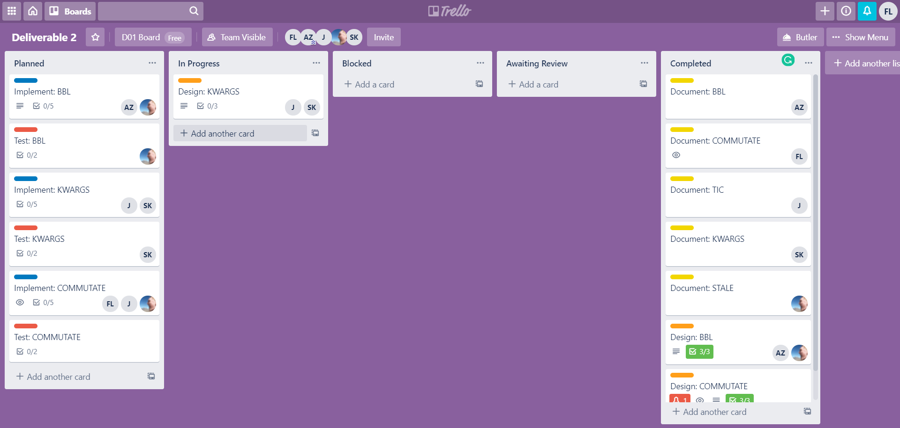
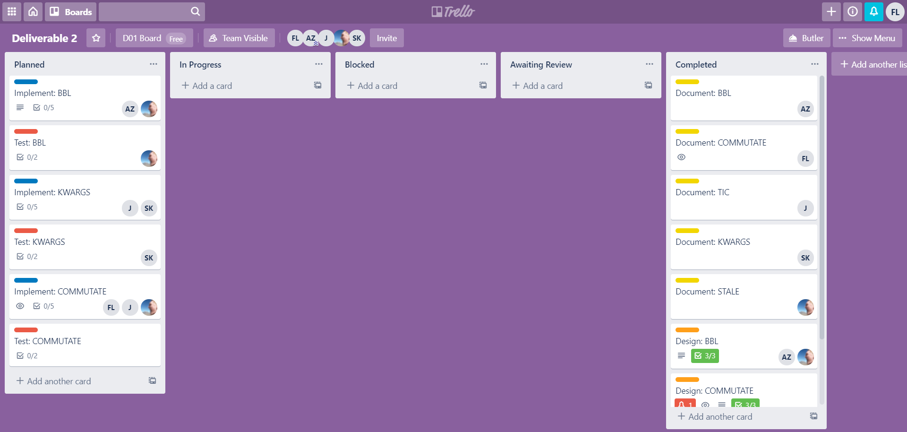

# Software Development Process

We have followed the TDD (Test Driven Development) Waterfall process that we described in the last deliverable for this deliverable. This process contains four phases.
1. **Requirements Gathering**
2. **Design** 
3. **Test Development**
4. **Implementation**

The project's longest stage was Requirements Gathering, as it involved choosing which issues to work on, dividing tasks among team members, and writing a document describing each of these issues. We chose 5 issues to provide a detailed description of the feature/bug, its location in the code, and an estimate of the time needed to implement the fix/feature.

We used a [Trello board](https://trello.com/b/e8RaV7Pi/deliverable-2) to keep track of the tasks for this deliverable. Note that this Trello board is private and can be viewed by invitation.

We had four types of tasks: **Documentation** (corresponding to **Requirements Gathering**), **Design**, **Test**, and **Implementation**. All five issues had **Documentation** cards, while the three issues that we've decided to implement each have **Design**, **Test**, and **Implementation** cards.

## Requirements Gathering

As mentioned, all five issues were part of this phase. Issues [14233]() (alias: **TIC**) and [9007]() (alias: **STALE**) were documented only, while issues [16389]() (alias: **COMMUTATE**), [1460]() (alias: **KWARGS**), [16482]() (alias: **BBL**) were also designed for, tested, and implemented.

We created a document for each of the issues, and provided details on:

-  **Description**: for bugs; the current behaviour of the functionality in question. For both bugs and features; the expected behaviour.
- **Location in Code**: for bugs; which methods/classes the bug is originating from. For features; which methods/classes would be changed to accomodate the feature.
- **Time Estimate** (optional): developer hours needed to implement the bug/feature. If the issue cannot be estimated before design, it may be omitted.

Here are some snapshots of the Trello board throughout the **Requirements Gathering** phase.

The commit marking the end of this phase was [9d4f753](https://github.com/CSCD01/team_04-project/commit/9d4f753ae68fccf4b8d25e74b44930421aac1f58). The state of the deliverable at this stage can be found [here](https://github.com/CSCD01/team_04-project/blob/9d4f753ae68fccf4b8d25e74b44930421aac1f58/deliverable/2/deliverable_2.md).

## Design

During the Design phase, we discuss multiple (if necessary) ways to implement the feature/bug-fix. We discuss the pros and cons of each approach (if there are multiple), reasons for proceeding with a specific approach, and possible risks (if any) associated with the implementation.

Here are some snapshots of the Trello board throughout the **Design** phase.

The commit marking the end of this phase was [54f9584](https://github.com/CSCD01/team_04-project/commit/54f9584e87e5d26ae96956e88217467546200da4). The state of the deliverable at this stage can be found [here](https://github.com/CSCD01/team_04-project/blob/54f9584e87e5d26ae96956e88217467546200da4/deliverable/2/deliverable_2.md).

## Test Development

During the Test Development phase, we developed both **unit tests** and **acceptance tests** for each of the issues. The unit tests were committed on a separate branch for that issue (e.g. for issue 16389, the unit tests were first committed on branch `deliverable_2_16389`), to the affected unit test suite. After this phase, there new unit test(s), and the acceptance test(s), are failing because the implementation has not been completed.

Here are some snapshots of the Trello board throughout the **Test Development** phase.

The commit marking the end of this phase was [c1a7758](https://github.com/CSCD01/team_04-project/commit/c1a77587efa5771e30e01d1e355b157f031e303b). The state of the deliverable at this stage can be found [here](https://github.com/CSCD01/team_04-project/blob/c1a77587efa5771e30e01d1e355b157f031e303b/deliverable/2/deliverable_2.md).

## Implementation

During the Implementation phase, we implement changes to the source code on the respective issue branches in our forked repository, and validate those changes with the tests that we have created during the **Test Development** phase. After this phase, the unit test(s) and acceptance tests pass.

Here are some snapshots of the Trello board throughout the **Implementation** phase.

The commit marking the end of this phase was [to-do](). The state of the deliverable at this stage can be found [here]().
