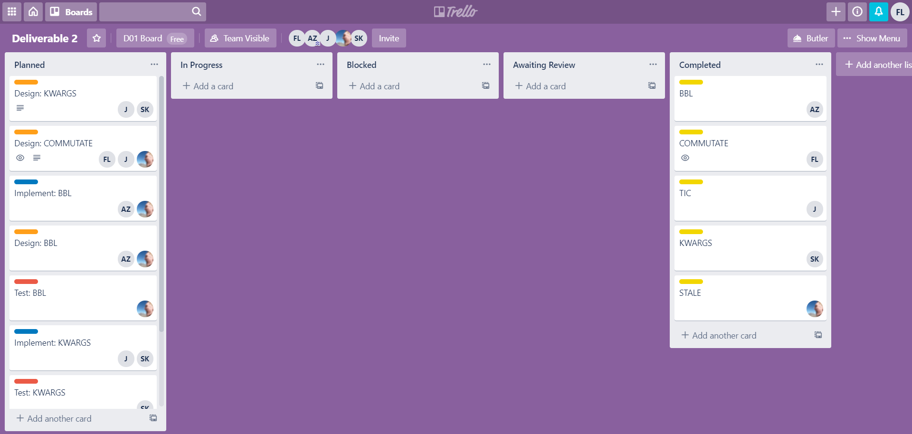

# Software Development Process

We have followed the TDD (Test Driven Development) Waterfall process that we described in the last deliverable for this deliverable. This process contains four phases.
1. **Requirements Gathering**
2. **Design** 
3. **Test Development**
4. **Implementation**

The project's longest stage was Requirements Gathering, as it involved choosing which issues to work on, dividing tasks among team members, and writing a document describing each of these issues. We chose 5 issues to provide a detailed description of the feature/bug, its location in the code, and an estimate of the time needed to implement the fix/feature.

We used a [Trello board](https://trello.com/b/e8RaV7Pi/deliverable-2) to keep track of the tasks for this deliverable. Note that this Trello board is private and can be viewed by invitation.

We had four types of tasks: **Documentation** (corresponding to **Requirements Gathering**), **Design**, **Test**, and **Implementation**. All five issues had **Documentation** cards, while the three issues that we've decided to implement each have **Design**, **Test**, and **Implementation** cards.

## Requirements Gathering

As mentioned, all five issues were part of this phase. Issues [14233](./14233.md) (alias: **TIC**) and [9007](./9007.md) (alias: **STALE**) were documented only, while issues [16389](./16389.md) (alias: **COMMUTATE**), [1460](./1460.md) (alias: **KWARGS**), [16482](./16482.md) (alias: **BBL**) were also designed for, tested, and implemented.

We created a document for each of the issues, and provided details on:

-  **Description**: for bugs; the current behaviour of the functionality in question. For both bugs and features; the expected behaviour.
- **Location in Code**: for bugs; which methods/classes the bug is originating from. For features; which methods/classes would be changed to accomodate the feature.
- **Time Estimate** (optional): developer hours needed to implement the bug/feature. If the issue cannot be estimated before design, it may be omitted.

The commit marking the start of this phase was [7fe869e](https://github.com/CSCD01/team_04-project/commit/7fe869c7d89ca1cc3cbcf95151e8ca74a99be128). The state of the deliverable at the start of this phase can be found [here](https://github.com/CSCD01/team_04-project/blob/7fe869c7d89ca1cc3cbcf95151e8ca74a99be128/deliverable/2/deliverable_2.md).

Here are some snapshots of the Trello board throughout the **Requirements Gathering** phase.

The commit marking the end of this phase was [9d4f753](https://github.com/CSCD01/team_04-project/commit/9d4f753ae68fccf4b8d25e74b44930421aac1f58). The state of the deliverable at the end of this phase can be found [here](https://github.com/CSCD01/team_04-project/blob/9d4f753ae68fccf4b8d25e74b44930421aac1f58/deliverable/2/deliverable_2.md).

## Design

During the Design phase, we discuss multiple (if necessary) ways to implement the feature/bug-fix. We discuss the pros and cons of each approach (if there are multiple), reasons for proceeding with a specific approach, and possible risks (if any) associated with the implementation.

The commit marking the start of this phase was [8f999e5](https://github.com/CSCD01/team_04-project/commit/8f999e548c28e2efda64e1e895e8bdd0e45922df). The state of the deliverable at the start of this phase can be found [here](https://github.com/CSCD01/team_04-project/blob/8f999e548c28e2efda64e1e895e8bdd0e45922df/deliverable/2/deliverable_2.md).

Here are some snapshots of the Trello board throughout the **Design** phase.

The commit marking the end of this phase was [54f9584](https://github.com/CSCD01/team_04-project/commit/54f9584e87e5d26ae96956e88217467546200da4). The state of the deliverable at the end of this phase can be found [here](https://github.com/CSCD01/team_04-project/blob/54f9584e87e5d26ae96956e88217467546200da4/deliverable/2/deliverable_2.md).

## Test Development

During the Test Development phase, we developed both **unit tests** and **acceptance tests** for each of the issues. The unit tests were committed on a separate branch for that issue (e.g. for issue 16389, the unit tests were first committed on branch `deliverable_2_16389`), to the affected unit test suite. After this phase, the new unit test(s), and the acceptance test(s), are failing because the implementation has not been completed.

The commit marking the start of this phase was [bdcd00a](https://github.com/CSCD01/team_04-project/commit/bdcd00a7caf835cbfc310204ccca27559c2944ca). The state of the deliverable at the start of this phase can be found [here](https://github.com/CSCD01/team_04-project/blob/bdcd00a7caf835cbfc310204ccca27559c2944ca/deliverable/2/deliverable_2.md).

Here are some snapshots of the Trello board throughout the **Test Development** phase.

The commit marking the end of this phase was [c1a7758](https://github.com/CSCD01/team_04-project/commit/c1a77587efa5771e30e01d1e355b157f031e303b). The state of the deliverable at the end of this phase can be found [here](https://github.com/CSCD01/team_04-project/blob/c1a77587efa5771e30e01d1e355b157f031e303b/deliverable/2/deliverable_2.md).

## Implementation

During the Implementation phase, we implement changes to the source code on the respective issue branches in our forked repository, and validate those changes with the tests that we have created during the **Test Development** phase. After this phase, the unit test(s) and acceptance tests pass. 

We created pull requests for each of these issues, which can be found [here](https://github.com/CSCD01-team04/matplotlib/pulls?q=is%3Apr+is%3Aclosed). After a sucessful peer review, the individual issue branches were merged to `master` of our forked repository. We marked the implementation of those issues as completed.

The commit marking the start of this phase was [2b97b3b](https://github.com/CSCD01/team_04-project/commit/2b97b3b71b0b56d3e5e3679ae2fc2448570ba88b). The state of the deliverable at the start of this phase can be found [here](https://github.com/CSCD01/team_04-project/blob/2b97b3b71b0b56d3e5e3679ae2fc2448570ba88b/deliverable/2/deliverable_2.md).

Here are some snapshots of the Trello board throughout the **Implementation** phase.

During this phase, after the implementation of the fix for issue 1460, we realized that we missed an important acceptance test case for it. After discovering the missing acceptance test, we went back to the **Testing** phase just for issue 1460, and created another acceptance test. 

Afterwards, we checked the implementation once more and confirmed that the newly added tests pass.

The commit marking the end of this phase was [cfc0c44](https://github.com/CSCD01/team_04-project/commit/cfc0c4451c0ec2f6bd2633124ab3a01b16587654). The state of the deliverable at the end of this phase can be found [here](https://github.com/CSCD01/team_04-project/blob/cfc0c4451c0ec2f6bd2633124ab3a01b16587654/deliverable/2/deliverable_2.md).

## Reflections 

We found that following this process was helpful because it made the process of implementation easier. Of course, the tradeoff was that **Requirements Gathering** and **Design** was rather intensive. It required that for each feature, we carefully note where the problem is in the code, and to think of a thoughtful design. 

**Testing** also came before **Implementation**, which also allowed us to ensure that the original requirements were met, because the tests were created according to those requirements. This meant that after the **Implementation** phase, we had confidence in the correctness of the code.

Overall, we thought that this process benefited our team for this deliverable.
