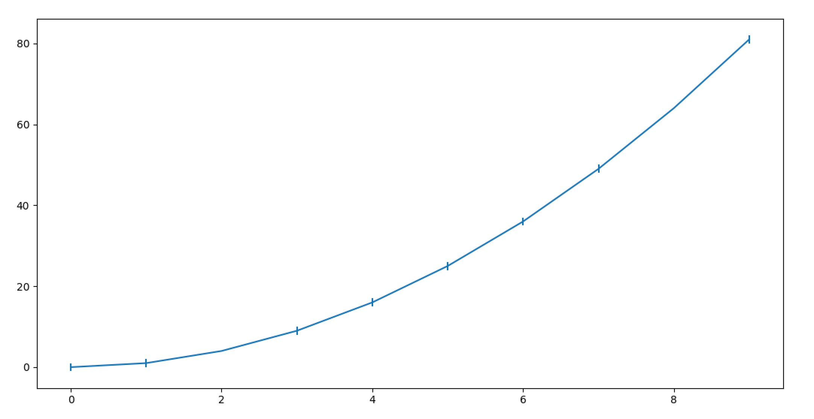
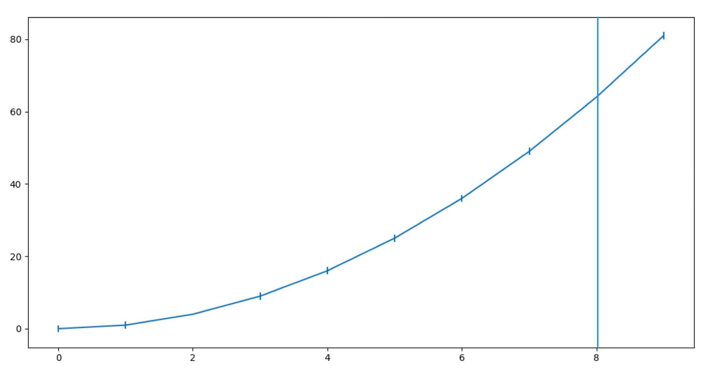
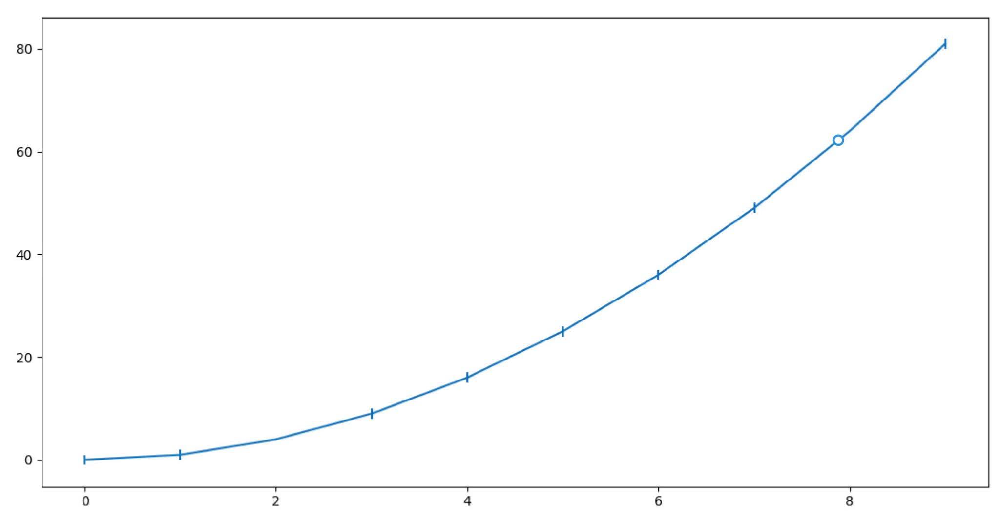
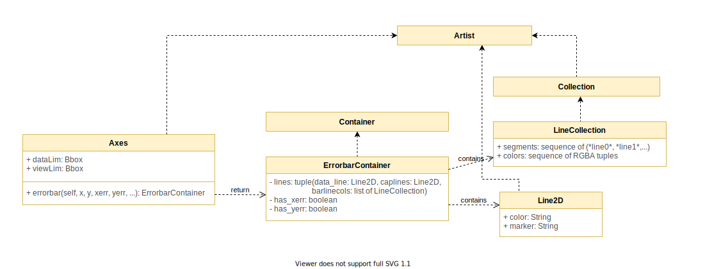

# [Issue 7876](https://github.com/matplotlib/matplotlib/issues/7876) #

Errorbar: do not ignore inf but plot errorbar bigger than current frame size

----------------------------------------------------

## Description


This change request is about the behaviour of error bars when supplied with an “infinite” range of error. The change request asked that “infinite” errors would be displayed with an error range that exceeds the frame size. This would serve as an intuitive visual that there is an “infinite” error range. Currently, when a data point either has an error of `inf`, this would result in no error bar for that particular data point. The same behaviour is seen when a data point has an error of `nan`. This behaviour could be confusing for errors, because one can argue that `nan` and `inf` are not really the same value.

There has been some discussion about the meaning of an infinite error which should be viewed as undefined, however, the change request is about representing the infinite error bar in a more explicit way so that the user would not get confused with a `nan` error bar. Moreover, by displaying an error bar can indicate what is happening at a particular data point and the user can be warned if that is not the expected output, instead of confusing it with `nan`.

Showing an error bar, presumably bigger than the size of the axes, when the error is `inf` would be a better representation over a non-existent error. Another proposed solution is to either remove the data point, or to plot a different symbol representing the infinite range of error. The error value does not necessarily represent `inf` but instead a  most accurate representation of the error can be undefined.

For instance, in the following example both instances of error bars with error `inf` and `nan` are plotted the same way, which means that the user cannot distinguish the errorbars from each other. The implementation of this feature would hopefully improve the intuitiveness of errorbars.

```
import numpy
import matplotlib.pyplot as plt
fig1, ax1 = plt.subplots(figsize=(15, 9))
a = numpy.arange(10)
b = a**2
c = numpy.array([1.0] * 10)
c[2] = numpy.nan
c[8] = numpy.inf
ax1.errorbar(a,b,c)
plt.show()

```



An example of a possible expected output where the error bar has the height of the `axes`.



An example of another possible expected output where the data point is removed to show that it is undefined.



## Affected Components & Location in Code



### Errorbar ###

**Errorbar** is defined in [Axes.py](https://github.com/matplotlib/matplotlib/blob/master/lib/matplotlib/axes/_axes.py#L3086). It corresponds to the range of error, or the size of the errorbar `xerr, yerr` of a particular point `x, y` in a graph. Sometimes a particular point has no range of error, so `xerr, yerr` can be omitted. 

There are other styling parameters such as `fmt` (formatting the data points and data lines, `ecolor` (specifying the colour of the errorbar line), `elinewidth` (specifying the linewidth of the errorbar lines), which we will omit in this documentation.

The parameters for `errorbar` are described below, based on matplotlib documentation.

```
def errorbar(self, x, y, yerr=None, xerr=None,
             fmt='', ecolor=None, elinewidth=None, capsize=None,
             barsabove=False, lolims=False, uplims=False,
             xlolims=False, xuplims=False, errorevery=1, capthick=None,
             **kwargs):
```

`x, y`: `scalar` or `array-like`: these are the data positions, corresponding to points on a graph. `x` can either be a scalar, or an array describing the x-coordinates of the data positions. `y` is similar. 

`xerr, yerr`: `scalar` or `array-like`, `shape(N,)` or `shape(2,N)`. This is an optional parameter, corresponding to the size of the error bar. The size of the errors can be customized for different use cases.
- **`scalar`**: all the data points have the same range of error. Symmetric +/- values for all data points in the graph.
- **`shape(N,)`**: each of the data points have their own range of error. Symmetric +/- values for each data point in the graph.
- **`shape(2,N)`**: each of the data-points can have a range of asymmetric errors. There are two rows; the first row describing the lower (-) errors, and the second row describing the upper (+) errors. 
- **`None`**: no errorbar.

`lolims`, `uplims`, `xololims`, and `xuplims`: these indicate whether or not a value only honours upper/lower limits (y-axis), or x-upper/x-lower limits (x-axis). A special caret symbol indicates that only a certain limit dimension is honoured. 

Here is a code snippet of where xerr and yerr are being handled. The `extract_err` method is described afterwards.

```
if xerr is not None:
    left, right = extract_err(xerr, x)
    # select points without upper/lower limits in x and
    # draw normal errorbars for these points
```
```
if yerr is not None:
    lower, upper = extract_err(yerr, y)
    # select points without upper/lower limits in y and
    # draw normal errorbars for these points
```

For the implementation of this feature, we would have to change the handling of `yerr` and `xerr`, to account for when the error is `inf`. This depends on the design decision (either an error bar exceeding the frame size, or a special symbol).

The `errorbar` method also defines two private functions [`xywhere()`](https://github.com/matplotlib/matplotlib/blob/master/lib/matplotlib/axes/_axes.py#L3319) and more importantly, [`extract_err()`](https://github.com/matplotlib/matplotlib/blob/master/lib/matplotlib/axes/_axes.py#L3330). This function takes two iterables `err` (which defines the errors for each data point), and `data` (the data points). Then it adds/subtracts those errors onto the data points and returns the upper and lower limit errors for the data. 

```
def extract_err(err, data):
    ...
    low = [v - e for v, e in zip(data, a)]
    high = [v + e for v, e in zip(data, b)]
    return low, high
```

The `errorbar` method returns an instance of `ErrorbarContainer`.

### ErrorbarContainer ###

[`ErrorbarContainer`](https://github.com/matplotlib/matplotlib/blob/master/lib/matplotlib/container.py#L71) extends `Container` and is described as the container for the artists for errorbars. It contains the datalines, with the error ranges corresponding to some data points. Errorbar takes as parameters `lines`, and `xerr`/`yerr`.

- `lines`: a tuple of (`data_line`, `caplines`, `barlinecols`)
    - `data_line`: an instance of `Line2D` which describes a line corresponding to data points.
    - `caplines`: a tuple of `Line2D` which correspond to the cap lines (tip of error range) for each data point.
    - `barlinecols`: a list of `LineCollection` corresponding to the error ranges.
- `xerr`/`yerr`: a boolean which is `True` if the errorbar has `x`/`y` errors, and `False` otherwise.

## Design Choices

Most or all of the code changes should be in the [`Axes.errorbar()`](https://github.com/matplotlib/matplotlib/blob/master/lib/matplotlib/axes/_axes.py#L3086) method. As mentioned previously, there has been discussion on whether or not an infinite range of error even makes sense. Currently it is treated the same as a range of error: `nan`. The question would be how to distinguish these two values.

We would need to change how we handle the inputs `xerr`, and `yerr`, to account for the value of `inf`.

### Tracing ###

To get an idea of how this change would need to fit in, it would be helpful to trace the `Axes.errorbar()` method. As mentioned previously, it takes parameters for the data points `x`,`y`, and the error ranges `xerr`,`yerr`. First, these parameters are turned into iterables, if they are not already. If `x='7'`, then it is converted to `x=['7']`. And if the error ranges are specified as, for example, `xerr='3'`, and there are 4 data points, then it is converted to `x=['3','3','3']`. 

In lines 3248 to 3297, the styles are applied for the plot, including the data line, and the errorbars (with barlines and caplines), and their associated markers. 

`xololims`, `xuplims`, `uplims`, and `lolims` are also converted into iterables so that they are compatible when processing data points.

In line 3322, there is a method `extract_err(err, data)`. As mentioned previously, this method parses the iterable `err` and adds/subtracts them to the data points `data`. It checks that `err` (which would either be `yerr` or `xerr`), is in the proper format. Recall that they must either be a `scalar`, or a `1D`/`(2,n)` array-like. If the format of `err` is valid, then it proceeds to add these error ranges to each data point. In lines 3354 and 3355, it does this using list comprehension.

```
low = [v - e for v, e in zip(data, a)]
high = [v + e for v, e in zip(data, b)]
```

Two arrays `low, high` are returned. `low` holds the lower error bounds, while `high` holds the upper error bounds.

In line 3358, the x-error range is handled. The left and right error bounds are extracted using the `extract_err()` method. Recall `xlolims` and `xuplims`. It checks if there are any data points that don't have such limits. If so, then we draw normal error bars for those data points. The errorbars for these points are defined in this block, and appended to the list of `barlines` and `caplines`.

If there are any data points for which we only want to draw the lower x-limits (left), then `xlolims` would be `True` for that point. The errorbar is drawn only for the left side of the data point, and a special caret symbol on the right.

Symmetrically, if `xuplims` is `True` for some point, then the errorbar is draw only for the right side of the data point. A special caret symbol is drawn on the left. 

In line 3407, the y-error range is handled. This works similarly to how the x-error range is handled, except that it deals with upper and lower limits (`lolims` and `uplims`).

Finally, an `ErrorbarContainer` instance is created, to house the `data_line`, `caplines`, and `barcols`. We also specify if the errors were for the y-direction, the x-direction, or both.

### Changes ###

Previously we described two options for displaying an `inf` errorbar.

The **first option** is to display an errorbar extending the frame size, to symbolize an infinite error range. The **second option** is to display a special marker on the data point, to symbolize the special value of `inf`.

It seems that there is currently no functionality in matplotlib that extends a graph beyond the framesize. Changing this behaviour seems overkill for an edge case such as an infinite range of error. Choosing not to extend the errorbar beyond the frame size would greatly reduce the API changes needed. Normally, the axes scales defines the range of the x and y axes depending on the plot data given. This is so that every data point is contained within the frame, including the range of errorbars.

The most we should do, along the same lines, would be to plot an errorbar that extends to the upper and lower bounds of the plot data. We could accompany this with a special symbol, and omit the caplines (if any), indicating that unbounded error. 

However, we also thought that simply having a special marker for the `inf` errorbar would be a cleaner (albeit less intuitive) representation. Thus, we think this choice should be deferred to the user. Within the `Axes.errorbar()` method, we could allow the user to choose how to represent an `inf` error. 

In addition to the changes proposed, a similar approach to the second option can be taken for the error `nan`. A special marker or symbol can be displayed on the data point to explicitly indicate the error range. In that case, the user could add special markers for both a `nan` and `inf` error for a better representation. 

These proposed changes are elaborated in [**Planned Implementation**](./7876_impl.md).

Note that there are no architectural changes involved in implementing this feature. There may be an additional parameter and a helper function in `Axes.errorbar()`, so this would count as an API change.