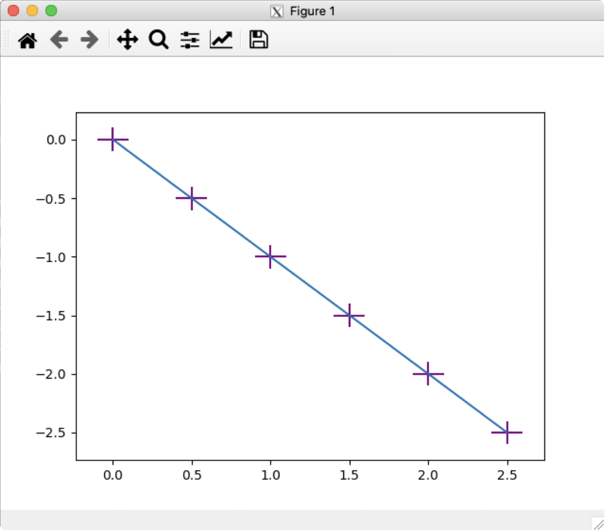
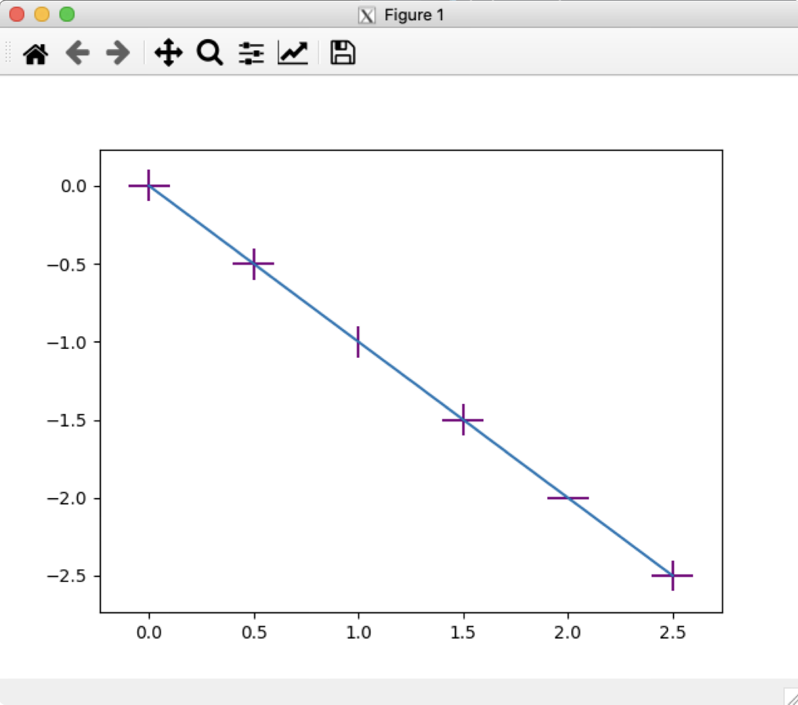
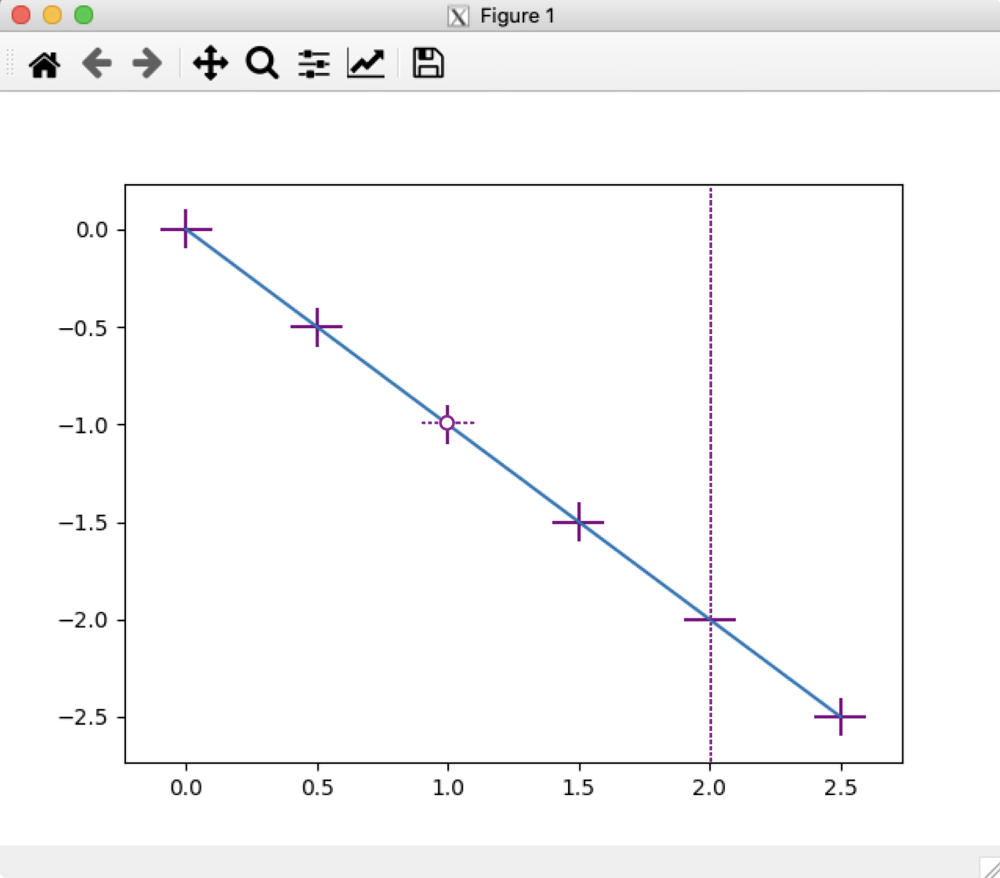
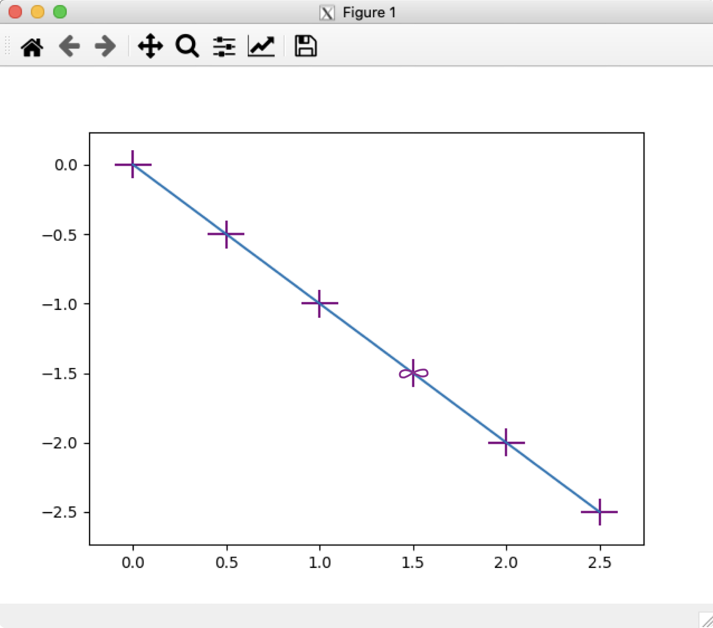
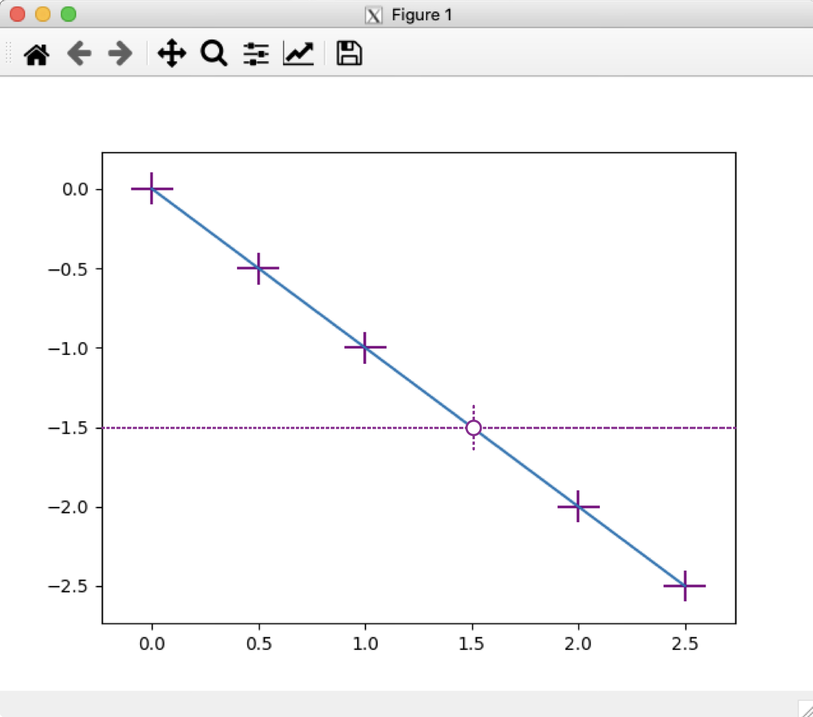

# User Acceptance Tests

To verify that the feature was properly implemented, the user can follow the steps below to replicate the different cases.

## UAT 1 - The feature does not interfere with the default case

The purpose of this test is that errorbars whose values are not `inf` and `nan` are not affected by the implementation of this feature.

1. Import `matplotlib.pyplot` and `numpy` libraries at the very top of the python file. For convenience, use `import matplotlib as plt` and `import numpy as np`.
2. Use `numpy` to initialize the the range of x. Use the `np.arange` method that will return an array of values given a start and end points, and step. For this test, we can make `x = np.arange(0, 3, 0.5)`. Make y represent the negative linear function `y = -x`.
3. Initialize a `Figure` using `plt.figure()`.
4. Plot the error bars for x and y. Make the bars for all x and y data points 0.1 long, and color them purple. Use `plt.errorbar(x, y, xerr=0.1, yerr=0.1, ecolor='purple')`.
5. Finally, write `plt.show()` to display the graph.

```
import matplotlib.pyplot as plt
import numpy as np

# Initialize the range of x points from 0 to 3 with
# an step of 0.5, and make the function negative linear
x = np.arange(0, 3, 0.5)
y = -x

# Initializes a figure
plt.figure()

# Plots error bars in the line
# Make all the horizonal and vertical errors for every 
# point be 0.1 and color them purple
plt.errorbar(x, y, xerr=0.1, yerr=0.1, ecolor='purple', nan_repr='symbol', inf_repr='bar')

# Display the graph
plt.show()

```

The output should be a plot of a negative linear function with x range from 0 to 3 and 0.5 step. Each data point should have two purple error bars, one horizontal and one vertical, of 0.1 lenght each.



## UAT 2 - `nan` and `inf` in different data points default case

The purpose of this test is to support backwards compatibility. When the new parameters `nan_repr` and `inf_repr` are not specified, the errorbars for `nan` and `inf` are displayed as they were before the implementation of this feature.

1. Import `matplotlib.pyplot` and `numpy` libraries at the very top of the python file. For convenience, use `import matplotlib as plt` and `import numpy as np`.
2. Use `numpy` to initialize the the range of x. Use the `np.arange` method that will return an array of values given a start and end points, and step. For this test, we can make `x = np.arange(0, 3, 0.5)`. Make y represent the negative linear function `y = -x`.
3. Make the bars for all x and y data points 0.1 by initializing two arrays of size 6 with values of 0.1. Name the arrays xerrors and yerros, use `np.array([0.1] * 6)`.
4. Change the third x error to `nan` and the fifth y error to `inf`. Use `xerrors[2] = np.nan` and `yerrors[4] = np.inf`.
5. Initialize a `Figure` using `plt.figure()`.
6. Plot the error bars for x and y and color them purple. Make the `nan` and the `inf` errors be represented as the default case, so they will not be displayed on the plot. Use `plt.errorbar(x, y, xerr=xerrors, yerr=yerrors, ecolor='purple')`, or `plt.errorbar(x, y, xerr=xerrors, yerr=yerrors, ecolor='purple')`.
7. Finally, write `plt.show()` to display the graph.

```
import matplotlib.pyplot as plt
import numpy as np

# Initialize the range of x points from 0 to 3 with
# an step of 0.5, and make the function negative linear
x = np.arange(0, 3, 0.5)
y = -x

# Make all the horizonal and vertical errors
# for every point be 0.1
xerrors = np.array([0.1] * 6)
yerrors = np.array([0.1] * 6)

# Change the third x error bar to be nan and
# change the fifth y error bar to be inf
xerrors[2] = np.nan
yerrors[4] = np.inf

# Initializes a figure
plt.figure()

# Plots error bars in the line and color them purple
plt.errorbar(x, y, xerr=xerrors, yerr=yerrors, ecolor='purple')

# Display the graph
plt.show()

```

The output should be a plot of a negative linear function with x range from 0 to 3 and 0.5 step. Each data point should have two purple error bars, one horizontal and one vertical, of 0.1 lenght each. In the third point, only the `yerror` bar should be displayed. In the fifth point, only the `xerror` should be displayed.



## UAT 3 - `nan` symbol and `inf` bar in different data points

The purpose of this test is to check the correctness of the `'bar'` representation of an `inf` errorbar, and the `'symbol'` representation of a `nan` errorbar, on different points.

1. Import `matplotlib.pyplot` and `numpy` libraries at the very top of the python file. For convenience, use `import matplotlib as plt` and `import numpy as np`.
2. Use `numpy` to initialize the the range of x. Use the `np.arange` method that will return an array of values given a start and end points, and step. For this test, we can make `x = np.arange(0, 3, 0.5)`. Make y represent the negative linear function `y = -x`.
3. Make the bars for all x and y data points 0.1 by initializing two arrays of size 6 with values of 0.1. Name the arrays xerrors and yerros, use `np.array([0.1] * 6)`.
4. Change the third x error to `nan` and the fifth y error to `inf`. Use `xerrors[2] = np.nan` and `yerrors[4] = np.inf`.
5. Initialize a `Figure` using `plt.figure()`.
6. Plot the error bars for x and y and color them purple. Make the `nan` errors be represented as a symbol and the `inf` errors be represented as a bar. Use `plt.errorbar(x, y, xerr=xerrors, yerr=yerrors, ecolor='purple', nan_repr='symbol', inf_repr='bar')`.
7. Finally, write `plt.show()` to display the graph.

```
import matplotlib.pyplot as plt
import numpy as np

# Initialize the range of x points from 0 to 3 with
# an step of 0.5, and make the function negative linear
x = np.arange(0, 3, 0.5)
y = -x

# Make all the horizonal and vertical errors
# for every point be 0.1
xerrors = np.array([0.1] * 6)
yerrors = np.array([0.1] * 6)

# Change the third x error bar to be nan and
# change the fifth y error bar to be inf
xerrors[2] = np.nan
yerrors[4] = np.inf

# Initializes a figure
plt.figure()

# Plots error bars in the line and color them purple
plt.errorbar(x, y, xerr=xerrors, yerr=yerrors, ecolor='purple', nan_repr='symbol', inf_repr='bar')

# Display the graph
plt.show()

```

The output should be a plot of a negative linear function with x range from 0 to 3 and 0.5 step. Each data point should have two purple error bars, one horizontal and one vertical, of 0.1 lenght each. In the third point, the `xerror` should be a dotted line of leght 0.1 with a dot in the middle. In the fifth point, the `yerror` should be a dotted vertical line drawn across the figure.



## UAT 4 - `inf` symbol in a data point

The purpose of this test is to check the correctness of the `'symbol'` representation of an `inf` errorbar.

1. Import `matplotlib.pyplot` and `numpy` libraries at the very top of the python file. For convenience, use `import matplotlib as plt` and `import numpy as np`.
2. Use `numpy` to initialize the the range of x. Use the `np.arange` method that will return an array of values given a start and end points, and step. For this test, we can make `x = np.arange(0, 3, 0.5)`. Make y represent the negative linear function `y = -x`.
3. Make the bars for all x and y data points 0.1 by initializing two arrays of size 6 with values of 0.1. Name the arrays xerrors and yerros, use `np.array([0.1] * 6)`.
4. Change the fourth x error to `inf`. Use `xerrors[3] = np.inf`.
5. Initialize a `Figure` using `plt.figure()`.
6. Plot the error bars for x and y and color them purple, make the `inf` errors be represented as an infinity symbol. Use `plt.errorbar(x, y, xerr=xerrors, yerr=yerrors, ecolor='purple', inf_repr='symbol')`.
7. Finally, write `plt.show()` to display the graph.

```
import matplotlib.pyplot as plt
import numpy as np

# Initialize the range of x points from 0 to 3 with
# an step of 0.5, and make the function negative linear
x = np.arange(0, 3, 0.5)
y = -x

# Make all the horizonal and vertical errors
# for every point be 0.1
xerrors = np.array([0.1] * 6)
yerrors = np.array([0.1] * 6)

# Change the fourth x error bar to be inf
xerrors[3] = np.inf

# Initializes a figure
plt.figure()

# Plots error bars in the line and color them purple
plt.errorbar(x, y, xerr=xerrors, yerr=yerrors, ecolor='purple', inf_repr='symbol')

# Display the graph
plt.show()

```

The output should be a plot of a negative linear function with x range from 0 to 3 and 0.5 step. Each data point should have two purple error bars, one horizontal and one vertical, of 0.1 lenght each. In the fourth point, the `xerror` should be an infinity symbol horizontally oriented.



## UAT 5 - `nan` and `inf` symbols in the same data point

The purpose of this test is to check the correctness of the `'symbol'` representations of both the `nan`, and `inf` errorbar, when plotted on the same data point.

1. Import `matplotlib.pyplot` and `numpy` libraries at the very top of the python file. For convenience, use `import matplotlib as plt` and `import numpy as np`.
2. Use `numpy` to initialize the the range of x. Use the `np.arange` method that will return an array of values given a start and end points, and step. For this test, we can make `x = np.arange(0, 3, 0.5)`. Make y represent the negative linear function `y = -x`.
3. Make the bars for all x and y data points 0.1 by initializing two arrays of size 6 with values of 0.1. Name the arrays xerrors and yerros, use `np.array([0.1] * 6)`.
4. Change the fourth x error to `nan` and the fourth y error to `inf`. Use `xerrors[3] = np.nan` and `yerrors[3] = np.inf`.
5. Initialize a `Figure` using `plt.figure()`.
6. Plot the error bars for x and y and color them purple. Make the `nan` and `inf` errors be represented as symbols. Use `plt.errorbar(x, y, xerr=xerrors, yerr=yerrors, ecolor='purple', nan_repr='symbol', inf_repr='symbol')`.
7. Finally, write `plt.show()` to display the graph.

```
import matplotlib.pyplot as plt
import numpy as np

# Initialize the range of x points from 0 to 3 with
# an step of 0.5, and make the function negative linear
x = np.arange(0, 3, 0.5)
y = -x

# Make all the horizonal and vertical errors
# for every point be 0.1
xerrors = np.array([0.1] * 6)
yerrors = np.array([0.1] * 6)

# Change the fourth x error bar to be nan and
# change the fourth y error bar to be inf
xerrors[3] = np.nan
yerrors[3] = np.inf

# Initializes a figure
plt.figure()

# Plots error bars in the line and color them purple
plt.errorbar(x, y, xerr=xerrors, yerr=yerrors, ecolor='purple', nan_repr='symbol', inf_repr='symbol')

# Display the graph
plt.show()

```

The output should be a plot of a negative linear function with x range from 0 to 3 and 0.5 step. Each data point should have two purple error bars, one horizontal and one vertical, of 0.1 lenght each. In the fourth point, the `xerror` should be a dotted line of leght 0.1 with a dot in the middle, and the `yerror` should be an infinity symbol horizontally oriented.


## UAT 6 - `nan` symbol and `inf` bar in the same data point

The purpose of this test is to check the correctness of the `'symbol'` representation of a `nan` errorbar, and the `'bar'` representation of the `inf` errorbar, when plotted on the same data point.

1. Import `matplotlib.pyplot` and `numpy` libraries at the very top of the python file. For convenience, use `import matplotlib as plt` and `import numpy as np`.
2. Use `numpy` to initialize the the range of x. Use the `np.arange` method that will return an array of values given a start and end points, and step. For this test, we can make `x = np.arange(0, 3, 0.5)`. Make y represent the negative linear function `y = -x`.
3. Make the bars for all x and y data points 0.1 by initializing two arrays of size 6 with values of 0.1. Name the arrays xerrors and yerros, use `np.array([0.1] * 6)`.
4. Change the fourth x error to `inf` and the fourth y error to `nan`. Use `xerrors[3] = np.inf` and `yerrors[3] = np.nan`.
5. Initialize a `Figure` using `plt.figure()`.
6. Plot the error bars for x and y and color them purple. Make the `nan` errors be represented as symbols and `inf` errors be represented as bars. Use `plt.errorbar(x, y, xerr=xerrors, yerr=yerrors, ecolor='purple', nan_repr='symbol', inf_repr='bar')`.
7. Finally, write `plt.show()` to display the graph.

```
import matplotlib.pyplot as plt
import numpy as np

# Initialize the range of x points from 0 to 3 with
# an step of 0.5, and make the function negative linear
x = np.arange(0, 3, 0.5)
y = -x

# Make all the horizonal and vertical errors
# for every point be 0.1
xerrors = np.array([0.1] * 6)
yerrors = np.array([0.1] * 6)

# Change the fourth x error bar to be inf and
# change the fourth y error bar to be nan
xerrors[3] = np.inf
yerrors[3] = np.nan

# Initializes a figure
plt.figure()

# Plots error bars in the line and color them purple
plt.errorbar(x, y, xerr=xerrors, yerr=yerrors, ecolor='purple', nan_repr='symbol', inf_repr='bar')

# Display the graph
plt.show()

```

The output should be a plot of a negative linear function with x range from 0 to 3 and 0.5 step. Each data point should have two purple error bars, one horizontal and one vertical, of 0.1 lenght each. In the fourth point, the `xerror` should be a dotted horizontal line drawn across the figure, and the `yerror` should be a dotted line of leght 0.1 with a dot in the middle.

