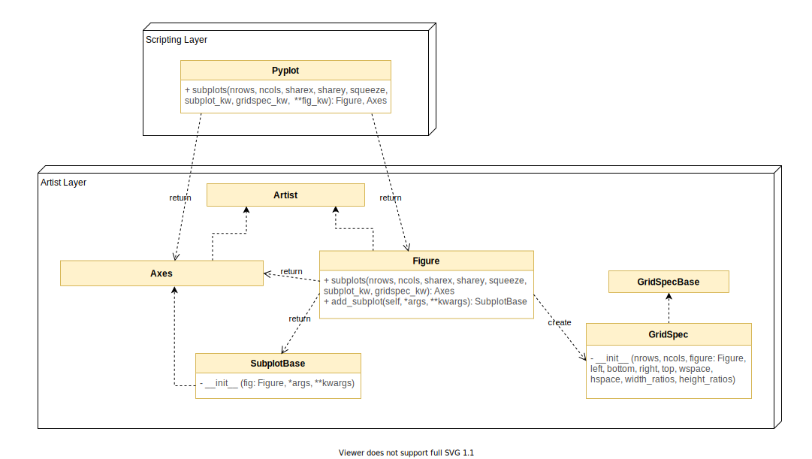

# Architecture of Issue 1460

For the feature detailed in [Issue 1460](https://github.com/matplotlib/matplotlib/issues/1460), there would be no architectural changes. This feature focuses on the interaction between `Pyplot.subplots()`, `Figure.subplots()`, `Figure.add_subplot()`, `SubplotBase`, `GridSpecBase`, which are all explained in more detail below.



## Pyplot and `Pyplot.subplots()`

The `Pyplot.subplots()` method is defined in [pyplot.py](https://github.com/matplotlib/matplotlib/blob/master/lib/matplotlib/pyplot.py#L1034). It's purpose is to create a figure and a set of subplots using the given arguments. This could draw one subplot or several, and it depends on the passed key word arguments. It functions as a convinient wrapper for multiple subplots that have the same format.  

The parameters for `subplots()` are described below, based on matplotlib documentation.

```
def subplots(nrows=1, ncols=1, sharex=False, sharey=False, squeeze=True,
             subplot_kw=None, gridspec_kw=None, **fig_kw):
```

`nrows, ncols`: an integer that represents the number of rows or columns for the subplot grid. 

`subplot_kw and gridspec_kw`: optional dictionaries of key word arguments, to be passed to `Figure.add_subplot()` and `GridSpec` respectively.

`**fig_kw`: a dictionary of keyword arguments, passed to the `Pyplot.figure()` method to create a `Figure`. 

## Figure

`Figure` is defined in [`figure.py`](https://github.com/matplotlib/matplotlib/blob/master/lib/matplotlib/figure.py#L219). It is a top level `Artist`, which is a container for a set of plot elements. `Figure` defines methods for manipulation of these plots. This is the main object that is manipulated and returned by the Artist Layer. 

`Figure` objects can be created with the following init method. Some parameters are omitted.
```
def __init__(self,
             figsize=None,
             dpi=None,
             facecolor=None,
             edgecolor=None,
             ...
             ):
```
It takes the following parameters (some omitted):
- `figsize`: 2-tuple of floats, representing the `Figure` dimension ``(width, height)`` in inches.
- `dpi`: Dots per inch.
- `facecolor`: The figure patch facecolor.
- `edgecolor`: The figure patch edge color.

### `Figure.subplots()` ###

[`Figure.subplots()`](https://github.com/matplotlib/matplotlib/blob/master/lib/matplotlib/figure.py#L1423) adds a set of subplots to the given figure object. The `Figure.subplots()` method takes arguments passed from the `Pyplot.subplots()` method, and as such they will not be explained in full. This is where `subplot_kw` parameters are consumed.

```
def subplots(self, nrows=1, ncols=1, sharex=False, sharey=False,
             squeeze=True, subplot_kw=None, gridspec_kw=None):
```

Note that as the figure already exists, there are no figure key word arguments to evaluate. All other parameters are used in the same way as `Pyplot.subplots` above.

### `Figure.add_subplot()` ###

Also in the `Figure` class, [`Figure.add_subplot()`](https://github.com/matplotlib/matplotlib/blob/master/lib/matplotlib/figure.py#L1245) adds a single `Axes` instance to the `Figure` as part of its subplot arrangement. This can handle a lot of overhead work for a detailed definition of the requested `Axes`, or draw a default one. `subplot_kw` arguments are also consumed here.

```
def add_subplot(self, *args, **kwargs):
```

`*args`: can be, a single integer, 3 integers corresponding to (*nrows*, *ncols*, *index*), or an instance of `Subplot`

In the case it is an instance of `Subplot`, it will have a few optional parameters

- **`projection`**: An optional parameter, that represents the projection type of the subplot `Axes`. 
- **`polar`**: An optional boolean parameter, which is True of the subplot is polar.
- **`sharex, sharey`**: An optional instance of `Axes`. Share the x or y `Axis` with the other Axes subplots. 
- **`label`**.

`**kwargs`: Additionally, these argument will be passed to the baseclass `Axes` when it is called. This would be where `subplot_kw` is consumed.


## GridSpec ##

The [GridSpec](https://github.com/matplotlib/matplotlib/blob/master/lib/matplotlib/gridspec.py#L238) class serves as a standardised way to specify the geometry of a grid that is placed on a plot. Simply put, it is a grid layout to place subplot within a figure.

```
__init__(self, nrows, ncols, figure=None,
         left=None, bottom=None, right=None, top=None,
         wspace=None, hspace=None,
         width_ratios=None, height_ratios=None):
```

The parameters are fairly straight forward:

`nrows, ncols`: an integer that represents the number of rows or columns for the subplot grid. 

`height_ratios, width_ratios`: An array like object of length `nrows` or `ncols` that is a ratio of the space for each column. 

`left, right, top, bottom`: An optional parameter, a float that is the extent of the subplots as a fraction of figure width or height.

`wspace, hspace`: floats that represent the spacing between subplots as a fraction of the axis width or height. 

## SubplotBase and `subplot_class_factory()`

The [`SubplotBase`](https://github.com/matplotlib/matplotlib/blob/master/lib/matplotlib/axes/_subplots.py#L11) is a baseclass for `Subplot`, and an instance of the `Axes` class. The class also defines methods for generating and manipulating a set of `Axes` within a figure.

```
def __init__(self, fig, *args, **kwargs):
```

It takes the ame method parameters as `Figure.add_subplot()`, but it also takes an instance of the `Figure` class.

[`subplot_class_factory()`](https://github.com/matplotlib/matplotlib/blob/master/lib/matplotlib/axes/_subplots.py#L180) is a method that can be found in the same file, and it's main purpose is to make a new class that inherits from `SubplotBase` and the given axes_class (which is assumed to be a subclass of `Axes`).

## Design Patterns Observed

We can see a **Factory Design Pattern** in the `subplot_class_factory()` function, as it produces a list of `SubplotBase` instances with every call. The flexibility to create and add multiple `Subplot`s to a `Figure`.

The use of `Figure` and other classes to act as wrappers help to keep the code managable, and reduces the amount of repeated code. It is great that one can manipulate and create a single `Figure` object to manage multiple subplots, with a great deal of control over each one individually. 
