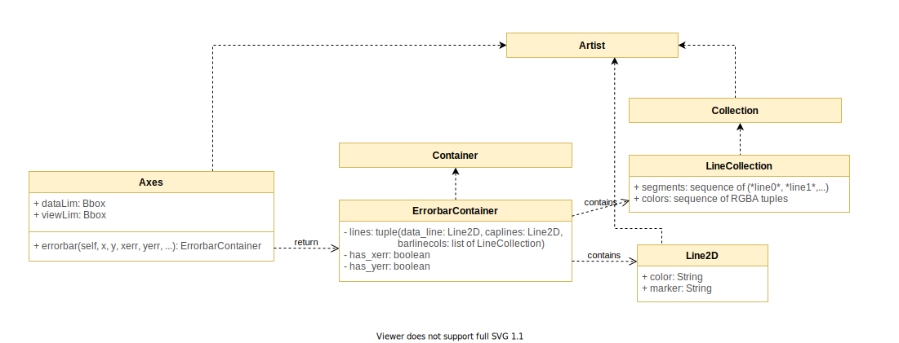

# Errorbars

For the feature that we decided to work on ([#7876](https://github.com/matplotlib/matplotlib/issues/7876)), we do not need to make any changes to the architecture as the implementation will be fully done inside the `errorbar` method located in [Axes.py](https://github.com/matplotlib/matplotlib/blob/master/lib/matplotlib/axes/_axes.py#L3086).

In order to design this feature, we needed to analyze more how does the `errorbar` method works and how it interacts with other classes and modules outside `Axes`. The `errorbar` method returns an instance of `ErrorbarContainer` which extends from the `Container` class.



## Container

The [`Container`](https://github.com/matplotlib/matplotlib/blob/master/lib/matplotlib/container.py) class is a subclass of `Artist` that helps gathering related `Artist` like the bars of a bar plot.

The `Container` class will group certain artists so the user can treat them as one instead of initialize them or work with them separately. Some of the `Container` subclasses include `BarContainer`, `ErrorbarContainer` and `StemContainer`.

## Errorbar Container

[`ErrorbarContainer`](https://github.com/matplotlib/matplotlib/blob/master/lib/matplotlib/container.py#L71) extends `Container` and is described as the container for the artists for errorbars. It contains the datalines, with the error ranges corresponding to some data points.

`ErrorbarContainer` takes as parameters `lines`, and `has_xerr`/`has_yerr`. The `lines` parameter is a tuple with information about the error bar cap lines, and ranges of the error. The `has_xerr`/`has_yerr` parameter is a boolean which is `True` if the errorbar has `x`/`y` errors.

## Errorbar

`Errorbar` is defined in [Axes.py](https://github.com/matplotlib/matplotlib/blob/master/lib/matplotlib/axes/_axes.py#L3086). It corresponds to the range of error, or the size of the errorbar `xerr, yerr` of a particular point `x, y` in a graph. Sometimes a particular point has no range of error, so `xerr, yerr` can be omitted. 

There are other styling parameters such as `fmt` (formatting the data points and data lines, `ecolor` (specifying the colour of the errorbar line), `elinewidth` (specifying the linewidth of the errorbar lines), which we will omit in this documentation.

The parameters for `errorbar` are described below, based on matplotlib documentation.

```
def errorbar(self, x, y, yerr=None, xerr=None,
             fmt='', ecolor=None, elinewidth=None, capsize=None,
             barsabove=False, lolims=False, uplims=False,
             xlolims=False, xuplims=False, errorevery=1, capthick=None,
             **kwargs):
```

`x, y`: `scalar` or `array-like`: these are the data positions, corresponding to points on a graph. `x` can either be a scalar, or an array describing the x-coordinates of the data positions. `y` is similar. 

`xerr, yerr`: `scalar` or `array-like`, `shape(N,)` or `shape(2,N)`. This is an optional parameter, corresponding to the size of the error bar. The size of the errors can be customized for different use cases.
- **`scalar`**: all the data points have the same range of error. Symmetric +/- values for all data points in the graph.
- **`shape(N,)`**: each of the data points have their own range of error. Symmetric +/- values for each data point in the graph.
- **`shape(2,N)`**: each of the data-points can have a range of asymmetric errors. There are two rows; the first row describing the lower (-) errors, and the second row describing the upper (+) errors. 
- **`None`**: no errorbar.

`lolims`, `uplims`, `xololims`, and `xuplims`: these indicate whether or not a value only honours upper/lower limits (y-axis), or x-upper/x-lower limits (x-axis). A special caret symbol indicates that only a certain limit dimension is honoured. 

Here is a code snippet of where xerr and yerr are being handled. The `extract_err` method is described afterwards.

```
if xerr is not None:
    left, right = extract_err(xerr, x)
    # select points without upper/lower limits in x and
    # draw normal errorbars for these points
```
```
if yerr is not None:
    lower, upper = extract_err(yerr, y)
    # select points without upper/lower limits in y and
    # draw normal errorbars for these points
```

The `errorbar` method also defines two private functions [`xywhere()`](https://github.com/matplotlib/matplotlib/blob/master/lib/matplotlib/axes/_axes.py#L3319) and more importantly, [`extract_err()`](https://github.com/matplotlib/matplotlib/blob/master/lib/matplotlib/axes/_axes.py#L3330). This function takes two iterables `err` (which defines the errors for each data point), and `data` (the data points). Then it adds/subtracts those errors onto the data points and returns the upper and lower limit errors for the data. 

```
def extract_err(err, data):
    ...
    low = [v - e for v, e in zip(data, a)]
    high = [v + e for v, e in zip(data, b)]
    return low, high
```

## Design Patterns Observed

The choice of using a `Container` class to group related artists helps to manage them as such instead of doing it individually. As the `Container` class is easily extendible, other subclasses can be implemented if a grouping is necessary.

The `errorbar` method from the `Axes` class returns the `ErrorbarContainer` which will tell the `Artist` what needs to be plotted. In other words, the `ErrorbarContainer` is in charge of plotting the error bars in the graph taking off the responsibility from the `Axes` class.