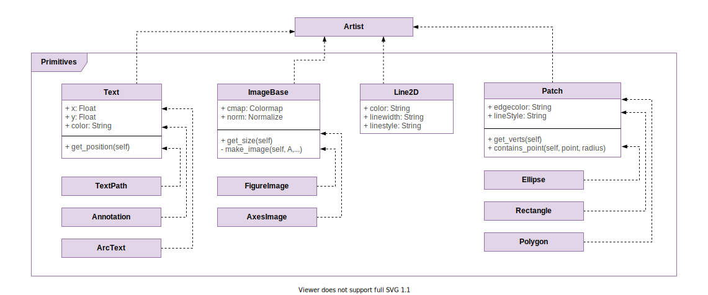

# Artist Layer

The Artist Layer defines visual components that are contained in a `Figure`. Every visual element you see in a `Figure`, such as lines, shapes, axes and ticks, are all `Artist` objects.

All these objects are a subclass of [`Artist`](https://github.com/matplotlib/matplotlib/blob/master/lib/matplotlib/artist.py), which defines methods and properties that are shared across all `Artist` implementations. One such method is [`Artist.update()`](https://github.com/matplotlib/matplotlib/blob/master/lib/matplotlib/artist.py#L972). Each `Artist` implementation can be customized with style properties (e.g. we can specify the `color`, `linestyle`, and `linewidth` of `Line2D`). `Artist.update()` takes these properties and applies them to the `Artist` instance. 

As mentioned previously, the Artist Layer can interact with the Backend Layer. One such method that allows that is the [`Artist.draw()`](https://github.com/matplotlib/matplotlib/blob/master/lib/matplotlib/artist.py#L902) method. This method uses a `renderer` (an instance of `RendererBase`) to draw itself, the `Artist`, on the `FigureCanvas`. 

`Artist` implementations fall into two categories. There are **primitives** and **composites**. 
## Primitives

We can describe primitives as being standalone visual objects: images, text, or lines. Primitives can stand on their own in a `Figure`, or they can also be contained in composites.

- [`Line2D`](https://github.com/matplotlib/matplotlib/blob/master/lib/matplotlib/lines.py) defines all sorts of lines and their various styles. They can be styled using a `color`, `linestyle`, and `linewidth`, among other properties. `Line2D` can be used as plot lines, ticks, or axes.
- Shape classes have a base class of [`Patch`](https://github.com/matplotlib/matplotlib/blob/master/lib/matplotlib/patches.py). It is extended by `Rectangle`, `Polygon`, `Circle`, and `Ellipse`. These shapes can be displayed by themselves in a `Figure`, or as to represent some data in a graph.
- Text classes have a base class of [`Text`](https://github.com/matplotlib/matplotlib/blob/master/lib/matplotlib/text.py). It is extended by `ArcText`, `Annotation`, and `TextPath`. Texts can be used as labels, titles, or in legends.
- Image classes have a base class of [`ImageBase`](https://github.com/matplotlib/matplotlib/blob/master/lib/matplotlib/image.py). It is extended by `AxesImage` and `FigureImage`.

Below are some `Patch` classes: `Circle`, `Wedge`, and `Polygon` contained within an `Axes` (image from [matplotlib.org](https://matplotlib.org/3.1.1/gallery/shapes_and_collections/patch_collection.html#sphx-glr-gallery-shapes-and-collections-patch-collection-py)).

## Composites

Composites are better understood as containers for other composites or primitives. Below is an image describing the anatomy of a `Figure` (image from [matplotlib.org](https://matplotlib.org/3.1.1/gallery/showcase/anatomy.html)).

Here is a list of composite `Artist` classes.

- [`Figure`](https://github.com/matplotlib/matplotlib/blob/master/lib/matplotlib/figure.py#L219) serves as a top-level container for all plot elements. A `Figure` contains all objects displayed: shapes, axes, and more. A `Figure` contains a reference to the `FigureCanvas` on which it is drawn, and can manipulate other `Artist` instances contained inside it. 
    - It can instruct the `FigureCanvas` to display itself using [`Figure.show()`](https://github.com/matplotlib/matplotlib/blob/master/lib/matplotlib/figure.py#L378), and set a new canvas using [`Figure.set_canvas()`](https://github.com/matplotlib/matplotlib/blob/master/lib/matplotlib/figure.py#L747).
    - It can add a set of subplots to itself using [`Figure.subplots()`](https://github.com/matplotlib/matplotlib/blob/master/lib/matplotlib/figure.py#L1423), and [`Figure.legend()`](https://github.com/matplotlib/matplotlib/blob/master/lib/matplotlib/figure.py#L1752) to add a legend to the `Figure`.
- [`Axes`](https://github.com/matplotlib/matplotlib/blob/master/lib/matplotlib/axes) is a container that holds elements part of a plot: their labels and titles, plot lines, shapes, and markers. It consists of most other `Artist` objects such as `Line2D`, `Text`, `Axis` (`YAxis` and `XAxis`), and `Patch`. 
- [`Axis`](https://github.com/matplotlib/matplotlib/blob/master/lib/matplotlib/axis.py#L630) is also a container for the axis title, ticks (which are instances of `Line2D`). Both `XAxis` and `Yaxis` extend `Axis`.
- [`Tick`](https://github.com/matplotlib/matplotlib/blob/master/lib/matplotlib/axis.py#L33) marks a position on the `Axis`. It consists of a `Line2D` tick marker, and a `Text` label.

