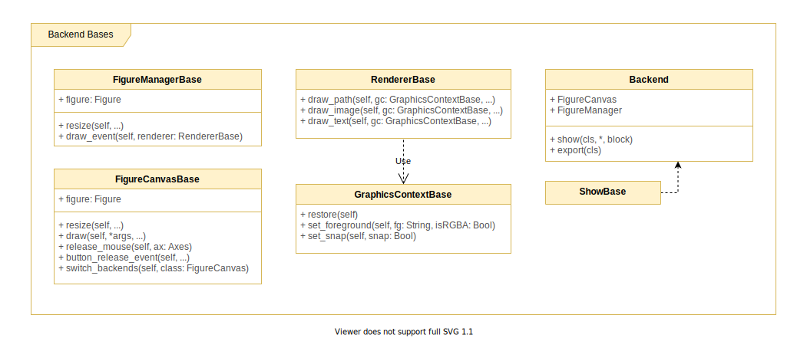
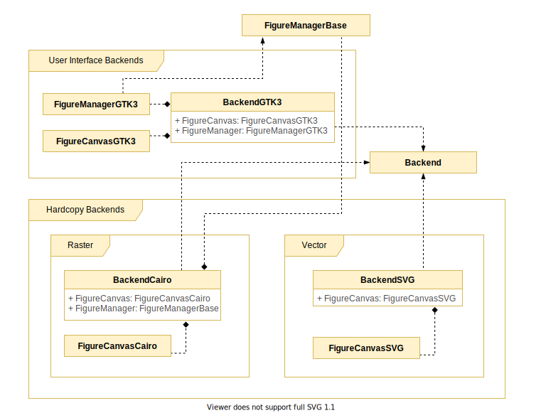
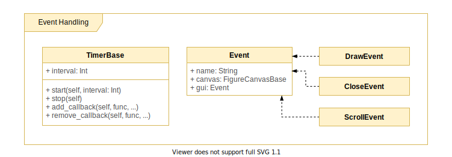
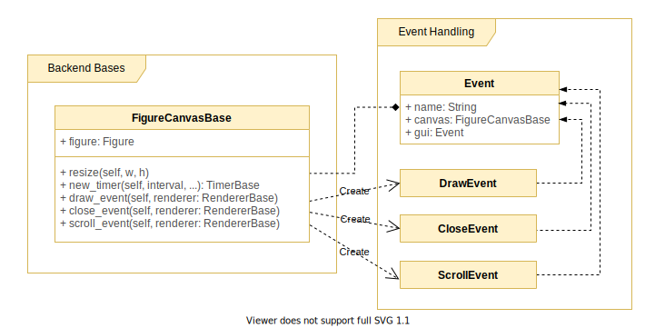

# Backend Layer

## Backend Base Classes

Abstract classes for most backend implementations are found [here](https://github.com/matplotlib/matplotlib/blob/master/lib/matplotlib/backend_bases.py). 

Both interactive and non-interactive backend implementations extend the following abstract base classes. Each of these classes have a clearly defined responsibility, all working together in rendering, displaying, and updating a `Figure`.

[`FigureCanvasBase`](https://github.com/matplotlib/matplotlib/blob/master/lib/matplotlib/backend_bases.py#L1538): the area (canvas) on which the `Figure` is rendered. The `Figure` holds a reference to a `FigureCanvas`, and uses it to draw itself.
  - The canvas can be resized using `FigureCanvasBase.resize()`.
  - There are also event related methods such as `FigureCanvasBase.draw_event()`, `FigureCanvasBase.close_event()` and `FigureCanvasBase.scroll_event()`, each of these create an instance of `DrawEvent`, `CloseEvent`, and `ScrollEvent`, respectively, passing them to the methods related to these events.
  - A new timer is created using [`FigureCanvasBase.new_timer()`](https://github.com/matplotlib/matplotlib/blob/master/lib/matplotlib/backend_bases.py#L2234) which returns a new instance of `TimerBase`.

[`FigureManagerBase`](): is used specifically by `Pyplot` to the interact with the window, independent of the backend used. It holds a reference to a `FigureCanvas`. A method `FigureManagerBase.show()` allows to show and redraw the `Figure` window.

[`RendererBase`](https://github.com/matplotlib/matplotlib/blob/master/lib/matplotlib/backend_bases.py#L118): handles drawing and rendering operations (for the `Figure`). Many of the rendering operations are handed off to `GraphicsContextBase`.
  - There are dedicated methods for drawing specific `Artist` instances such as `RendererBase.draw_path()`, `Renderer.draw_text()`, and `Renderer.draw_image()`, which draws a `Path`, `Text`, and `Image` respectively.

[`GraphicsContextBase`](https://github.com/matplotlib/matplotlib/blob/master/lib/matplotlib/backend_bases.py#L704): is used by the `RendererBase`. It is reponsible for handling colour and line styles, and blending properties.
  - There are mostly getter and setter methods, such as `GraphicsContextBase.set_linewidth()`, `GraphicsContextBase.set_capstyle()`, which renders these style properties for an `Artist` instance.

[`Backend`](https://github.com/matplotlib/matplotlib/blob/master/lib/matplotlib/backend_bases.py#L3305): An abstract base class that is extended by each of the backend implementations, such as `backendPdf`, `backendSVG`, among others. When implemented, it allows the backend implementation to define which `FigureCanvas` and `FigureManager` it will use. 

## Backend Implementations

There are interactive (user-interface) backends, and non-interactive (hard copy) backend implementations. These implementations reside [here](https://github.com/matplotlib/matplotlib/blob/master/lib/matplotlib/backends). Each backend implementation extends `Backend`, and defines which `FigureCanvas` and `FigureManager` it will use.

### User Interface Backends

These backends support rendering for user interfaces of applications. An example would be `BackendGTK3`, which uses `FigureManagerGTK3` and `FigureCanvasGTK3` (implementations of `FigureManagerBase`, and `FigureCanvasBase`, respectively).

### Hard Copy Backends

These backends support rendering for standalone files such as PDF. Hard copy backends are further categorized to **Raster**, and **Vector**. 

An example of a **Raster** backend is `BackendCairo`, which uses `FigureCanvasCairo` (an implementation of `FigureCanvasBase`

An example of a **Vector** backend is `BackendSVG`, which uses `FigureCanvasSVG` (an implementation of `FigureCanvasBase`).

## Event Handling

The Backend Layer also provides classes that support event handling.

- [`Event`](https://github.com/matplotlib/matplotlib/blob/master/lib/matplotlib/backend_bases.py#L1179) is extended by `MouseEvent`, `ResizeEvent`, and `DrawEvent`. Different event classes are responsible for handling user input, such as keyboard strokes and mouse movement. As mentioned earlier, the `FigureCanvas` creates these `Event` instances and passes them to related methods. Thus, `Event` has a reference to the `FigureCanvas` that created it.
- [`TimerBase`](https://github.com/matplotlib/matplotlib/blob/master/lib/matplotlib/backend_bases.py#L1023) supports event timing and callbacks through methods such as `TimerBase.start()`, `TimerBase.stop()`, and `TimerBase.add_callback()`, and `TimerBase.remove_callback()`. As mentioned earlier, `FigureCanvasBase.new_timer()` creates and returns these.

## Design Patterns Observed

We can see the **Factory Design Pattern** in the relationship between `FigureCanvasBase` and `Event` classes. As mentioned earlier, an `Event` is a base class for events such as `ScrollEvent`, `DrawEvent`, and `CloseEvent`. The `FigureCanvasBase` has methods that creates appropriate `Event` classes and passes them to related methods. Thus, the instantiation of `Event` subclasses are never made directly, but through these methods. 

`FigureCanvasBase.draw_event()`, `FigureCanvasBase.close_event()` and `FigureCanvasBase.scroll_event()`, each create an instance of `DrawEvent`, `CloseEvent`, and `ScrollEvent`, respectively, passing them to the methods related to these events.

