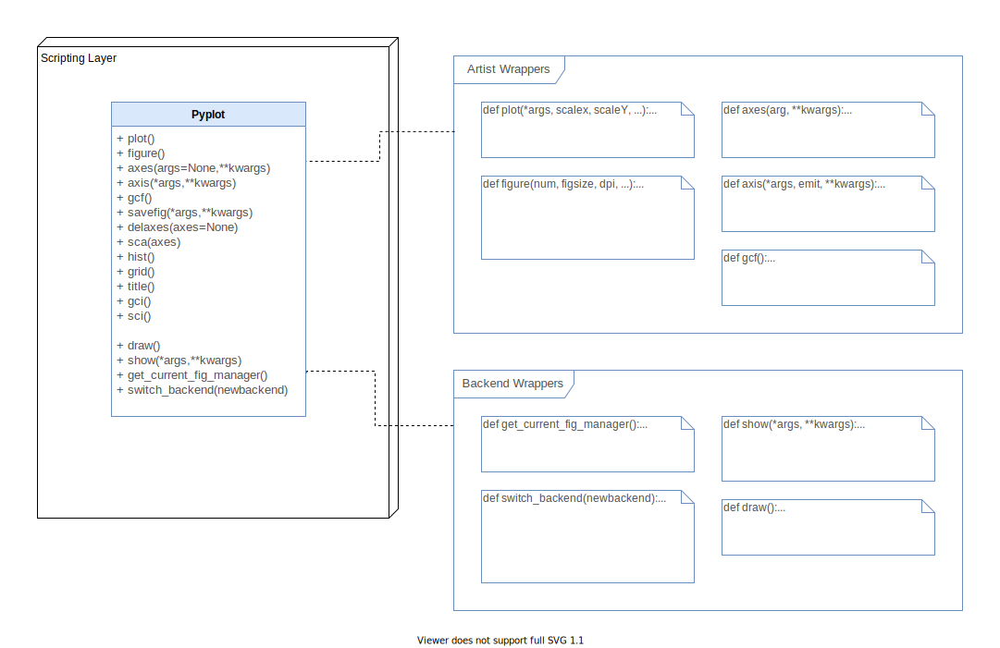
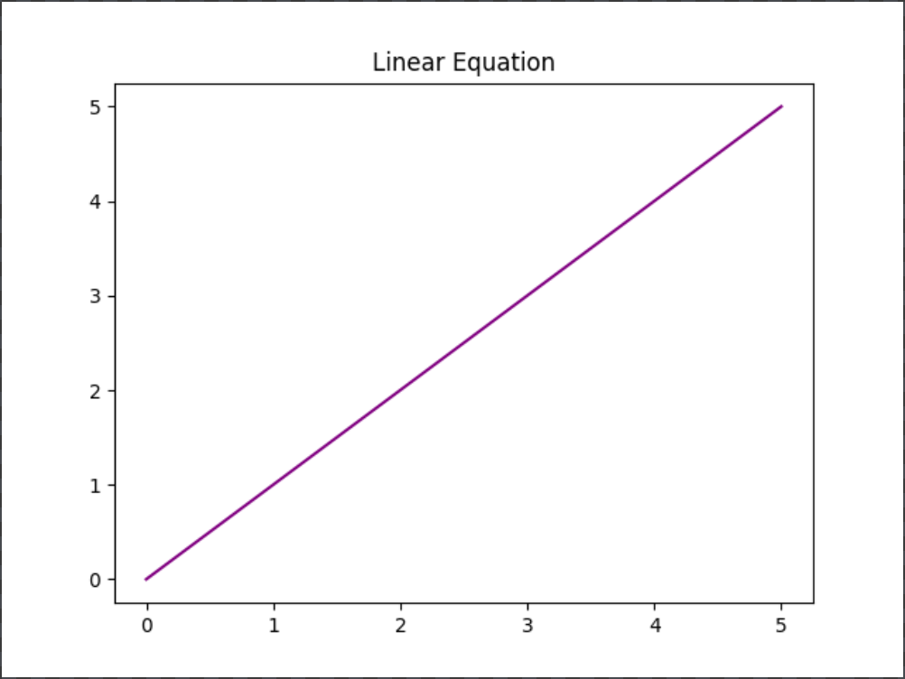

# Scripting Layer

## Pyplot Interface

Pyplot allows the Scripting Layer to act as a wrapper of the Artist and Backend Layers, where the implementation of these functions occur. Pyplot is the user interface to simplify the task of working with the other two layers.

The user can either work with the Artist and Backend Layers directly or use the Scripting Layer instead, where they do not need to initialize figures or specify their preferred backend. Pyplot will select the default backend (or the previously configured one) and call a `setup()` method that will initialize the appropriate objects needed given the selected backend (interactive or hardcopy) .

The pyplot interface provides the following functions (non-exhaustive) to manage the components returned by the `setup()` method:

### Artist Layer wrappers

- `plot()`: calls the current `Figure`’s Axes object’s `plot()` method and the `draw()` method of the `FigureCanvas`
- `figure()`: creates or activates a new `Figure`
- `savefig()`: saves the current `Figure`
- `axes()`: adds an `Axes` to the current `Figure` and makes it the current `Axes`
- `gcf()`: returns the current `Figure`
- `sca(ax)`: sets the current `Axes` to `ax` and the current `Figure` to the parent of `ax`

### Backend Layer wrappers
- `draw()`: redraws the current `Figure`
- `get_current_fig_manager()`: returns the current  `FigureManager`
- `switch_backend()`: allows the user to change the selected backend
- `show()`: displays all figures



## Benefits of Pyplot

`Pyplot`'s main goal is to simplify the use of `Matplotlib` by grouping some functions where some tasks are taken over by one method instead of multiple methods. For example, a `Figure` does not need to be initialized before starting to plot, as `Pyplot` will have a default `Figure` and `FigureCanvas` to use if it has not being specified. In other words, the first plot instruction that will be called would get assigned the tasks to create a `Figure` and `FigureCanvas`.

Below there is an example of plotting a linear graph of range 0 to 5 using both matplotlib directly and `Pyplot`. On the first lines of code, we need to initialize the figure by calling the `Figure` method from `Artist`, then, we need to create a canvas using that empty `Figure`. After that is done, we need to indicate where we want to draw the `Axes`. By using `fig.add_subplot(111)`, we indicate that we want to subdivide out canvas in a 1 by 1 grid and plot our `Axes` in the first (and only) grid.

We proceed then to plot the line in the `Axes` and set a title. To see the final result, we need to save the `Figure`.

### Using Matplotlib directly
```
from matplotlib.backends.backend_agg import FigureCanvasAgg as FigureCanvas
from matplotlib.figure import Figure

fig = Figure()
canvas = FigureCanvas(fig)

ax = fig.add_subplot(111)

x = [0,1,2,3,4,5]

ax.plot(x, x, color='purple')

ax.set_title('Linear Equation')

fig.savefig('mpl_linear.png') 
```

However, when using `Pyplot` we do not need to initialize a `Figure` or a `FigureCanvas`. We can proceed to directly plot the line that we need. Moreover, we do not need to save the figure to see the final result, we can use `plt.show()` instead.

### Using Pyplot

```
import matplotlib.pyplot as plt

x = [0,1,2,3,4,5]

plt.plot(x, x, color='purple')

plt.title('Linear Equation')

# plt.savefig('mpl_linear.png')

plt.show()
```

