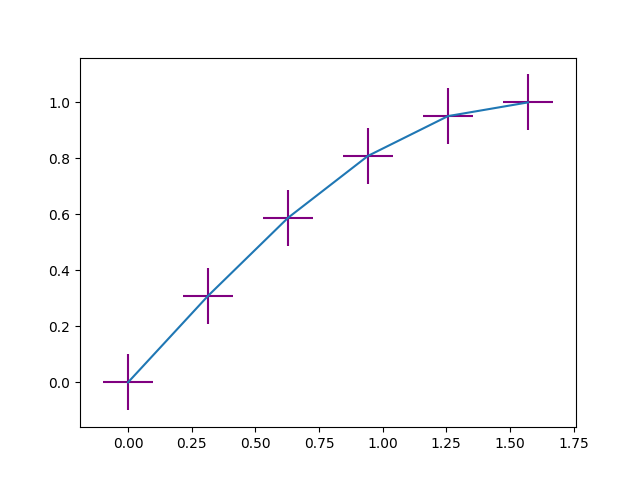
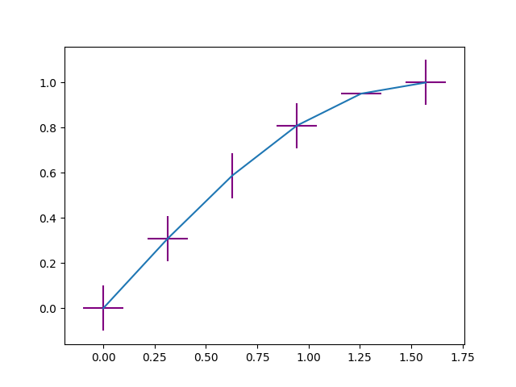
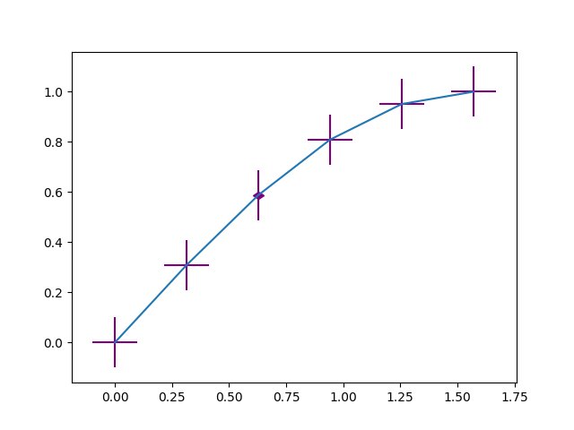
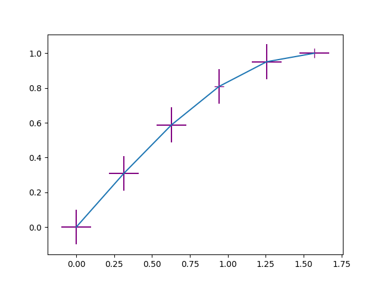
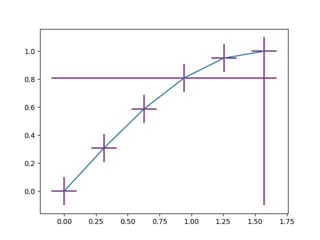
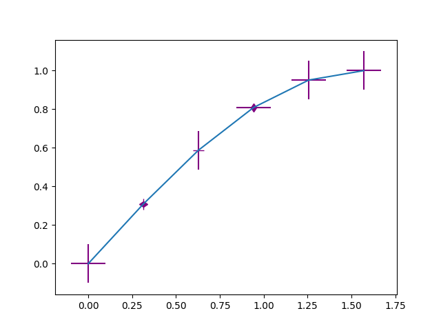
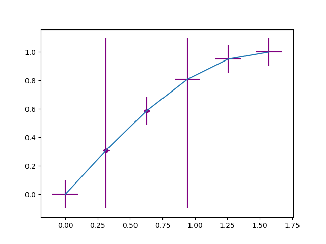

# Acceptance Tests

To verify that the feature was properly implemented, the user can follow the steps below to replicate the different cases.

Note that all of the below acceptance tests have similar initialization steps. It involves importing the necessary libraries, and setting up our range of x and y data points. We also initially set up a default set of x errorbars and y errorbars for the data points. In some acceptance tests, these errorbars are changed. We have summarized these two steps:

1. Import `matplotlib.pyplot` and `numpy` libraries at the very top of the python file. For convenience, use `import matplotlib as plt` and `import numpy as np`.
2. Use `numpy` to initialize the the range of x. Use the `np.linespace` method that will return an array of values given a start and end points, and number of points. For this test, we can use `np.linspace(0, np.pi/2, 6)`. Make y represent the sinusoidal function `y = np.sin(x)`.

In the below tests, we resume from step 3.

## 1. No `nan` and `inf` errorbars on a plot

The purpose of this test is that errorbars whose values are not `inf` and `nan` are not affected by the implementation of this feature, even if the errorbar types are defined.

3. Initialize a `Figure` using `plt.figure()`.
4. Plot the errorbars for x and y. Make the bars for all x and y data points 0.1 long, and color them purple. Use `plt.errorbar(x, y, xerr=0.1, yerr=0.1, ecolor='purple')`.
5. Finally, write `plt.show()` to display the graph.

```
import matplotlib.pyplot as plt
import numpy as np

# Initialize the range of x points from 0 to pi/2 with
# a step of 0.5, and form a sinusoidal function
x = np.linspace(0, np.pi/2, 6)
y = np.sin(x)

# Initializes a figure
plt.figure()

# Plots errorbars in the line
# Make all the horizonal and vertical errors for every 
# point be 0.1 and color them purple
plt.errorbar(x, y, xerr=0.1, yerr=0.1, ecolor='purple', nan_repr='symbol', inf_repr='bar')

# Display the graph
plt.show()

```

The output should be the plot of a sinusoidal function formed by 6 data points in the x range from 0 to pi/2. Each data point should have two purple errorbars, one horizontal and one vertical, of 0.1 length each.



## 2. `nan_repr` and `inf_repr` are omitted when calling `Axes.errorbar()`

The purpose of this test is to support backwards compatibility. When the new parameters `nan_repr` and `inf_repr` are not specified, the errorbars for `nan` and `inf` are displayed as they were before the implementation of this feature, which will be considered the default value.

3. Make the bars for all x and y data points 0.1 by initializing two arrays of size 6 with values of 0.1. Name the arrays `xerrors` and `yerrors`, use `np.array([0.1] * 6)`.
4. Change the third x error to `nan` and the fifth y error to `inf`. Use `xerrors[2] = np.nan` and `yerrors[4] = np.inf`.
5. Initialize a `Figure` using `plt.figure()`.
6. Plot the errorbars for x and y and color them purple. Make the `nan` and the `inf` errors be represented as the default case, so they will not be displayed on the plot. Use `plt.errorbar(x, y, xerr=xerrors, yerr=yerrors, ecolor='purple')`, or `plt.errorbar(x, y, xerr=xerrors, yerr=yerrors, ecolor='purple')`.
7. Finally, write `plt.show()` to display the graph.

```
import matplotlib.pyplot as plt
import numpy as np

# Initialize the range of x points from 0 to pi/2 with
# a step of 0.5, and form a sinusoidal function
x = np.linspace(0, np.pi/2, 6)
y = np.sin(x)

# Make all the horizonal and vertical errors
# for every point be 0.1
xerrors = np.array([0.1] * 6)
yerrors = np.array([0.1] * 6)

# Change the third x errorbar to be nan and
# Change the fifth y errorbar to be inf
xerrors[2] = np.nan
yerrors[4] = np.inf

# Initializes a figure
plt.figure()

# Plots errorbars in the line and color them purple
plt.errorbar(x, y, xerr=xerrors, yerr=yerrors, ecolor='purple')

# Display the graph
plt.show()

```

The output should be the plot of a sinusoidal function formed by 6 data points in the x range from 0 to pi/2. Each data point should have two purple errorbars, one horizontal and one vertical, of 0.1 length each. At the third point, only the y errorbar should be displayed. In the fifth point, only the x errorbar should be displayed.



## 3. `nan` symbol plotted at a data point

The purpose of this test is to check the correctness of the `'symbol'` representation of a `nan` errorbar.

3. Make the bars for all x and y data points 0.1 by initializing two arrays of size 6 with values of 0.1. Name the arrays `xerrors` and `yerrors`, use `np.array([0.1] * 6)`.
4. Change the third x error to `nan`. Use `xerrors[2] = np.nan`.
5. Initialize a `Figure` using `plt.figure()`.
6. Plot the errorbars for x and y and color them purple. Use the `'symbol'` representation of the `nan` errorbars. Use `plt.errorbar(x, y, xerr=xerrors, yerr=yerrors, ecolor='purple', nan_repr='symbol')`.
7. Finally, write `plt.show()` to display the graph.

```
import matplotlib.pyplot as plt
import numpy as np

# Initialize the range of x points from 0 to pi/2 with
# a step of 0.5, and form a sinusoidal function
x = np.linspace(0, np.pi/2, 6)
y = np.sin(x)

# Make all the horizonal and vertical errors
# for every point be 0.1
xerrors = np.array([0.1] * 6)
yerrors = np.array([0.1] * 6)

# Change the third x errorbar to be nan
xerrors[2] = np.nan

# Initializes a figure
plt.figure()

# Plots errorbars in the line and color them purple
plt.errorbar(x, y, xerr=xerrors, yerr=yerrors, ecolor='purple', nan_repr='symbol')

# Display the graph
plt.show()

```

The output should be a plot of a sinusoidal function formed by 6 data points in the x range from `0` to `pi/2`. Each data point should have two purple errorbars, one horizontal and one vertical, of 0.1 length each. At the third point, the x errorbar should have a small rhombus at the datapoint horizontally oriented.



## 4. `inf` symbol plotted at a data point

The purpose of this test is to check the correctness of the `'symbol'` representation of an `inf` errorbar. The `inf` `'symbol'` representation is oriented based on the type of error: horizontal orientation if it is an x error, or a vertical orientation if it is a y-error.

3. Make the bars for all x and y data points 0.1 by initializing two arrays of size 6 with values of 0.1. Name the arrays `xerrors` and `yerrors`, use `np.array([0.1] * 6)`.
4. Change the fourth x error and the fifth y error to `inf`. Use `xerrors[3] = np.inf` and `yerrors[4] = np.inf`.
5. Initialize a `Figure` using `plt.figure()`.
6. Plot the errorbars for x and y and color them purple. Use the `'symbol'` representation for the `inf` errorbar. Use `plt.errorbar(x, y, xerr=xerrors, yerr=yerrors, ecolor='purple', inf_repr='symbol')`.
7. Finally, write `plt.show()` to display the graph.

```
import matplotlib.pyplot as plt
import numpy as np

# Initialize the range of x points from 0 to pi/2 with
# a step of 0.5, and form a sinusoidal function
x = np.linspace(0, np.pi/2, 6)
y = np.sin(x)

# Make all the horizonal and vertical errors
# for every point be 0.1
xerrors = np.array([0.1] * 6)
yerrors = np.array([0.1] * 6)

# Change the fourth x errorbar to be inf
xerrors[3] = np.inf
# Change the fifth y errorbar to be inf
yerrors[5] = np.inf

# Initializes a figure
plt.figure()

# Plots errorbars in the line and color them purple
plt.errorbar(x, y, xerr=xerrors, yerr=yerrors, ecolor='purple', inf_repr='symbol')

# Display the graph
plt.show()

```

The output should be a plot of a sinusoidal function formed by 6 data points in the x range from 0 to pi/2. Each data point should have two purple errorbars, one horizontal and one vertical, of 0.1 length each. At the fourth point, the x errorbar should be a short thin line horizontally oriented. Similarly at the fifth point, the y errorbar should be a short thin line vertically oriented.



## 5. `inf` bar plotted at a data point

The purpose of this test is to check the correctness of the `'bar'` representation of the `inf` errorbar, when plotted on a data point.

3. Make the bars for all x and y data points 0.1 by initializing two arrays of size 6 with values of 0.1. Name the arrays `xerrors` and `yerrors`, use `np.array([0.1] * 6)`.
4. Change the fourth x error and the fifth y error to `inf`. Use `xerrors[3] = np.inf` and `yerrors[4] = np.inf`.
5. Initialize a `Figure` using `plt.figure()`.
6. Plot the errorbars for x and y and color them purple. Use the `'bar'` representation for `inf` errorbars. Use `plt.errorbar(x, y, xerr=xerrors, yerr=yerrors, ecolor='purple', inf_repr='bar')`.
7. Finally, write `plt.show()` to display the graph.

```
import matplotlib.pyplot as plt
import numpy as np

# Initialize the range of x points from 0 to pi/2 with
# a step of 0.5, and form a sinusoidal function
x = np.linspace(0, np.pi/2, 6)
y = np.sin(x)

# Make all the horizonal and vertical errors
# for every point be 0.1
xerrors = np.array([0.1] * 6)
yerrors = np.array([0.1] * 6)

# Change the fourth x errorbar to be inf
xerrors[3] = np.inf
# Change the fifth y errorbar to be inf
yerrors[5] = np.inf

# Initializes a figure
plt.figure()

# Plots errorbars in the line and color them purple
plt.errorbar(x, y, xerr=xerrors, yerr=yerrors, ecolor='purple', inf_repr='bar')

# Display the graph
plt.show()
```

The output should be a plot of a sinusoidal function formed by 6 data points in the x range from 0 to pi/2. Each data point should have two purple errorbars, one horizontal and one vertical, of 0.1 length each. At the fourth point, the x errorbar should a have a horizontal line passing through the data point, where the size of the line should be the width of the plot. Similarly at the fifth point, the y errorbar should have a vertical line passing through the data point, where the size of the line should be the height of the plot.



## 6. `nan` symbol and `inf` symbol plotted at data points

The purpose of this test is to check the correctness of the `'symbol'` representations of both the `nan`, and `inf` errorbar. We test the scenario when they are plotted on the same data point, and also when they are plotted at different data points

3. Make the bars for all x and y data points 0.1 by initializing two arrays of size 6 with values of 0.1. Name the arrays `xerrors` and `yerrors`, use `np.array([0.1] * 6)`.
4. Change the second x error to `nan` and the second y error to `inf`. Use `xerrors[1] = np.nan` and `yerrors[1] = np.inf`.
5. Change the third x error to `nan`. Use `xerrors[2] = np.nan`
6. Change the fourth y error to `inf`. Use `xerrors[3] = np.inf`
7. Initialize a `Figure` using `plt.figure()`.
8. Plot the errorbars for x and y and color them purple. Use the `'symbol'` representation for both the `nan` and `inf` errorbars. Use `plt.errorbar(x, y, xerr=xerrors, yerr=yerrors, ecolor='purple', nan_repr='symbol', inf_repr='symbol')`.
9. Finally, write `plt.show()` to display the graph.

```
import matplotlib.pyplot as plt
import numpy as np

# Initialize the range of x points from 0 to pi/2 with
# a step of 0.5, and form a sinusoidal function
x = np.linspace(0, np.pi/2, 6)
y = np.sin(x)

# Make all the horizonal and vertical errors
# for every point be 0.1
xerrors = np.array([0.1] * 6)
yerrors = np.array([0.1] * 6)

# Change the second x errorbar to be nan
xerrors[1] = np.nan
# Change the second y errorbar to be inf
yerrors[1] = np.inf
# Change the third x errorbar to be inf
xerrors[2] = np.inf
# Change the fourth y errorbar to be nan
yerrors[3] = np.nan

# Initializes a figure
plt.figure()

# Plots errorbars in the line and color them purple
plt.errorbar(x, y, xerr=xerrors, yerr=yerrors, ecolor='purple', nan_repr='symbol', inf_repr='symbol')

# Display the graph
plt.show()

```

The output should be a plot of a sinusoidal function formed by 6 data points in the x range from 0 to pi/2. Each data point should have two purple errorbars, one horizontal and one vertical, of 0.1 length each. At the second point, the y errorbar should have a short thin vertical line, and the x errorbar should have a small rhombus horizontally oriented. At the third point, the x errorbar should have a short thin horizontal line. At the fourth point, the y errorbar should have a small rhombus vertically oriented.



## 7. `nan` symbol and `inf` bar plotted at data points

The purpose of this test is to check the correctness of the `'symbol'` representation of the `nan` errorbar, and the `'bar'` representation of the ``inf` errorbar. We test the scenario when they are plotted on the same data point, and also when they are plotted at different data points

3. Make the bars for all x and y data points 0.1 by initializing two arrays of size 6 with values of 0.1. Name the arrays `xerrors` and `yerrors`, use `np.array([0.1] * 6)`.
4. Change the second x error to `nan` and the second y error to `inf`. Use `xerrors[1] = np.nan` and `yerrors[1] = np.inf`.
5. Change the third x error to `nan`. Use `xerrors[2] = np.nan`
6. Change the fourth y error to `inf`. Use `xerrors[3] = np.inf`
7. Initialize a `Figure` using `plt.figure()`.
8. Plot the errorbars for x and y and color them purple. Use the `'symbol'` representation for `nan` errorbars, and the `'bar'` representation for `inf` errorbars. Use `plt.errorbar(x, y, xerr=xerrors, yerr=yerrors, ecolor='purple', nan_repr='symbol', inf_repr='bar')`.
9. Finally, write `plt.show()` to display the graph.

```
import matplotlib.pyplot as plt
import numpy as np

# Initialize the range of x points from 0 to pi/2 with
# a step of 0.5, and form a sinusoidal function
x = np.linspace(0, np.pi/2, 6)
y = np.sin(x)

# Make all the horizonal and vertical errors
# for every point be 0.1
xerrors = np.array([0.1] * 6)
yerrors = np.array([0.1] * 6)

# Change the second x errorbar to be nan
xerrors[1] = np.nan
# Change the second y errorbar to be inf
yerrors[1] = np.inf
# Change the third x errorbar to be nan
xerrors[2] = np.nan
# Change the fourth y errorbar to be inf
yerrors[3] = np.inf

# Initializes a figure
plt.figure()

# Plots errorbars in the line and color them purple
plt.errorbar(x, y, xerr=xerrors, yerr=yerrors, ecolor='purple', nan_repr='symbol', inf_repr='bar')

# Display the graph
plt.show()

```

The output should be a plot of a sinusoidal function formed by 6 data points in the x range from 0 to pi/2. Each data point should have two purple errorbars, one horizontal and one vertical, of 0.1 length each. At the second point, the y errorbar should have a vertical line passing through the data point, where the size of the line should be the height of the plot, and the x errorbar should have a small rhombus horizontally oriented. At the third point, the x errorbar should have a small rhombus horizontally oriented. At the fourth point, the y errorbar should have a vertical line passing through the data point, where the size of the line should be the height of the plot. 

