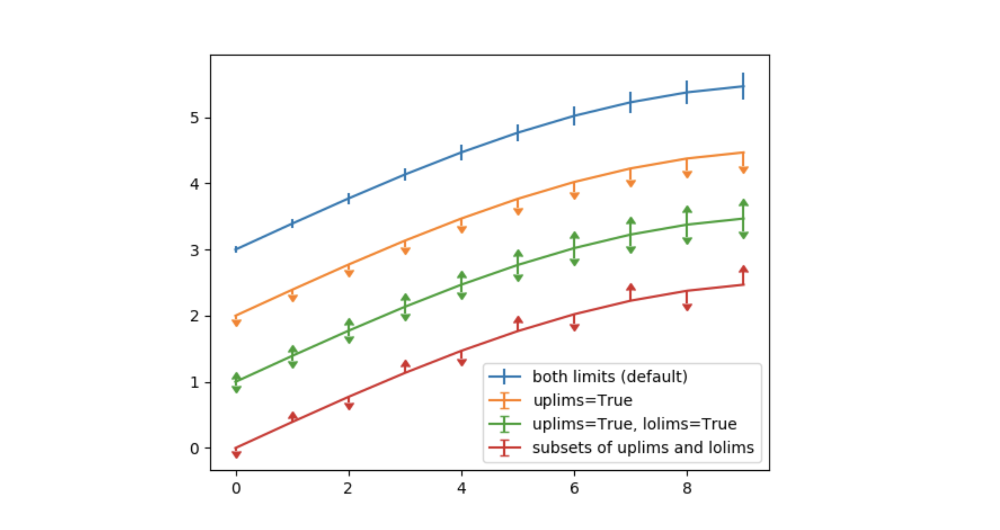

# Documentation

## Description

Currently, errorbars behave unintuitively for datapoints that have non-number (`nan` or `inf`) error values; the errorbars are omitted altogether. This behaviour can cause confusion, because one can argue that `nan` and `inf` are not really the same value. 

The following example shows that both `nan` and `inf` errorbars are plotted the same way. The user is unable to distinguish the errorbars from each other.

```
import numpy
import matplotlib.pyplot as plt

fig1, ax1 = plt.subplots(figsize=(15, 9))
a = numpy.arange(10)
b = a**2

c = numpy.array([1.0] * 10)
c[2] = numpy.nan # errorbar of nan
c[8] = numpy.inf # errorbar of inf

ax1.errorbar(a,b,c)
plt.show()

```


The requested change is about the representation of `inf` errorbars. There are two main representation for `inf` that can be considered. Option one: an error bar that extends axes frames. The following image shows this.


The other option is to either remove the data point, or to plot a different symbol representing the infinite errorbar. We have to be careful when choosing the appropriate symbol, so that the user can easily interpret it as the `inf` errorbar. The following image shows this. 


The implementation of this feature would hopefully improve the intuitiveness of errorbars, allowing the user to distinguish between `inf` and `nan` errorbars.

## Affected Components & Location in Code


### Errorbar ###

The [`Axes.errorbar()`](https://github.com/matplotlib/matplotlib/blob/master/lib/matplotlib/axes/_axes.py#L3086) method takes as input a set of data points, and the error ranges for those data points. It then applies those errors to the data points as errorbars. The data points and their errors are returned in a `Container`.

There are other styling parameters such as `fmt` (formatting the data points and data lines, `ecolor` (specifying the colour of the errorbar line), `elinewidth` (specifying the linewidth of the errorbar lines), which we will omit in this documentation.

The parameters for `errorbar` are described below, based on matplotlib documentation.

```
def errorbar(self, x, y, yerr=None, xerr=None,
             fmt='', ecolor=None, elinewidth=None, capsize=None,
             barsabove=False, lolims=False, uplims=False,
             xlolims=False, xuplims=False, errorevery=1, capthick=None,
             **kwargs):
```

`x, y`: `scalar` or `array-like`. These are the data positions, corresponding to points on a graph. `x` can either be a scalar, or an array describing the x-coordinates of the data positions. `y` is similar. 

`xerr, yerr`: `scalar` or `array-like`, `shape(N,)` or `shape(2,N)`. This is an optional parameter, corresponding to the size of the errorbar. The size of the errors can be customized for different use cases.
- **`scalar`**: all the data points have the same range of error. Symmetric +/- values for all data points in the graph.
- **`shape(N,)`**: each of the data points have their own range of error. Symmetric +/- values for each data point in the graph.
- **`shape(2,N)`**: each of the data-points can have a range of asymmetric errors. There are two rows; the first row describing the lower (-) errors, and the second row describing the upper (+) errors. 
- **`None`**: no errorbar.

`lolims`, `uplims`, `xololims`, and `xuplims`. These are booleans indicating whether or not a value only honours upper/lower limits (y-axis), or x-upper/x-lower limits (x-axis). A special caret symbol indicates that only a certain limit dimension is honoured. 



Here is a code snippet of where xerr and yerr are being handled. The `extract_err` method is described afterwards.

```
if xerr is not None:
    left, right = extract_err(xerr, x)
    # select points without upper/lower limits in x and
    # draw normal errorbars for these points
```
```
if yerr is not None:
    lower, upper = extract_err(yerr, y)
    # select points without upper/lower limits in y and
    # draw normal errorbars for these points
```

For the implementation of this feature, we would have to change the handling of `yerr` and `xerr`, to account for when the error is `inf`. This depends on the design decision (either an errorbar exceeding the frame size, or a special symbol).

The `errorbar` method also defines two private functions [`xywhere()`](https://github.com/matplotlib/matplotlib/blob/master/lib/matplotlib/axes/_axes.py#L3319) and more importantly, [`extract_err()`](https://github.com/matplotlib/matplotlib/blob/master/lib/matplotlib/axes/_axes.py#L3330). This function takes two iterables `err` (which defines the errors for each data point), and `data` (the data points). It then adds/subtracts those errors onto the data points and returns the upper and lower limit errors for the data. 

```
def extract_err(err, data):
    ...
    low = [v - e for v, e in zip(data, a)]
    high = [v + e for v, e in zip(data, b)]
    return low, high
```

The `errorbar` method returns an instance of `ErrorbarContainer`.

### ErrorbarContainer ###

[`ErrorbarContainer`](https://github.com/matplotlib/matplotlib/blob/master/lib/matplotlib/container.py#L71) extends `Container` and is described as the container for the artists for errorbars. It contains the datalines, with the error ranges corresponding to some data points. Errorbar takes as parameters `lines`, and `xerr`/`yerr`.

- `lines`: a tuple of (`data_line`, `caplines`, `barlinecols`)
    - `data_line`: an instance of `Line2D` which describes a line corresponding to data points.
    - `caplines`: a tuple of `Line2D` which correspond to the cap lines (tip of error range) for each data point.
    - `barlinecols`: a list of `LineCollection` corresponding to the error ranges.
- `xerr`/`yerr`: a boolean which is `True` if the errorbar has `x`/`y` errors, and `False` otherwise. More specifically `xerr` is `True` if there are errorbars affecting the `x`-coordinates for datapoints. `yerr` is similar.