# Software Development Process

We have followed the TDD (Test Driven Development) Waterfall process that we first described in [Deliverable 1](../1/process.md) for this deliverable. This process consists of four phases.
1. **Requirements Gathering**
2. **Design** 
3. **Test Development**
4. **Implementation**

Normally, Requirements Gathering would be the longest phase. However, we have already done a bulk of this work in Deliverable 3. We were fortunate to not require extensive updates on documentation.

This deliverable is different that Deliverable 2, where we had to keep track of 5 small bugs/features. Testing and Implementation should hold the majority of our work, as well as documenting the changes we made. 

We used a [Trello board](https://trello.com/b/KEeCMz3y/deliverable-3-4) to keep track of the tasks for this deliverable. Note that this Trello board is private and can be viewed by invitation. We had five types of tasks: **Documentation** (corresponding to **Requirements Gathering**), **Design**, **Testing**, **Implementation**, and **Miscellaneous** (corresponding to "maintenance" tasks that don't fit in our process).

## Requirements Gathering

For this phase, we wanted to distinguish the original problem which the feature is based on. We see that features are based on existing problems, so it's important to:

1. Figure out what the problem is.
2. Why it is a problem: is it an issue with usability, efficiency, or otherwise?

Once we know of the problem, then we need to assess where in the code the problem is originating from. For this phase, we also described the components affected by this feature, and the specific locations in code.

Overall, in this phase we discussed the **Description** of the feature, and the problem it is trying to solve. We also discussed the **Affected Components and Location in Code**.

The commit marking the start of this phase was [64b77bb](https://github.com/CSCD01/team_04-project/commit/64b77bbcb2a91a07fa1435f702a6083678799d41). The state of the deliverable at the start of this phase can be found [here](https://github.com/CSCD01/team_04-project/blob/64b77bbcb2a91a07fa1435f702a6083678799d41/deliverable/4/deliverable_4.md).

Here are some snapshots of the Trello board throughout the **Requirements Gathering** phase.

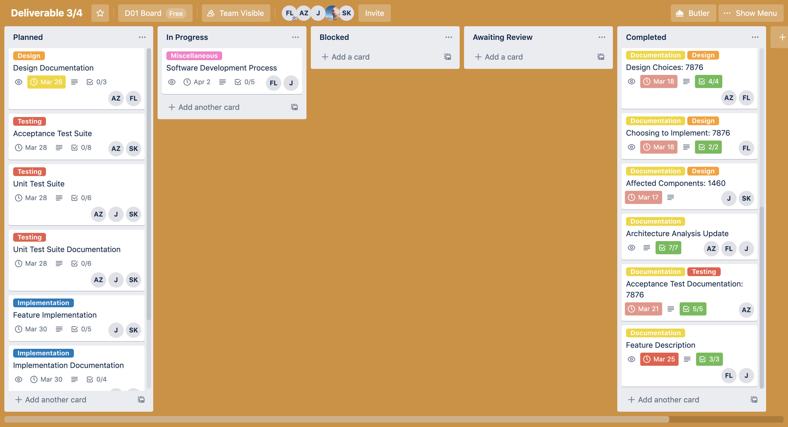

The commit marking the end of this phase was [751991a](https://github.com/CSCD01/team_04-project/commit/751991aaf324c8e9755c242efc21692953e5f7de). The state of the deliverable at the end of this phase can be found [here](https://github.com/CSCD01/team_04-project/blob/751991aaf324c8e9755c242efc21692953e5f7de/deliverable/4/deliverable_4.md).

## Design

During the Design phase, we elaborate on the components affected by our new feature. We identify which methods and/or classes that we need to change. Then, we discuss multiple ways (if necessary) to implement our feature. We discuss the pros and cons of each approach (if there are multiple), reasons for proceeding with a specific approach, and possible risks associated with the implementation.

Understanding the design choices would be difficult without knowledge of how the affected code works. Thus, we have included a **Tracing** section, which goes through the affected method `Axes.errorbar()`. We discuss what this method achieves, block by block. Then, we describe an overview of the possible implementations, and why we chose to move forward with a certain one, in the **Changes** section. We elaborate on the chosen implementation in the **Planned Implementation** section.

The commit marking the start of this phase was [feaf07f](https://github.com/CSCD01/team_04-project/commit/feaf07f09f181b388ed878fcc029087f0d622a7b). The state of the deliverable at the start of this phase can be found [here](https://github.com/CSCD01/team_04-project/blob/feaf07f09f181b388ed878fcc029087f0d622a7b/deliverable/4/deliverable_4.md).

Here are some snapshots of the Trello board throughout the **Design** phase.

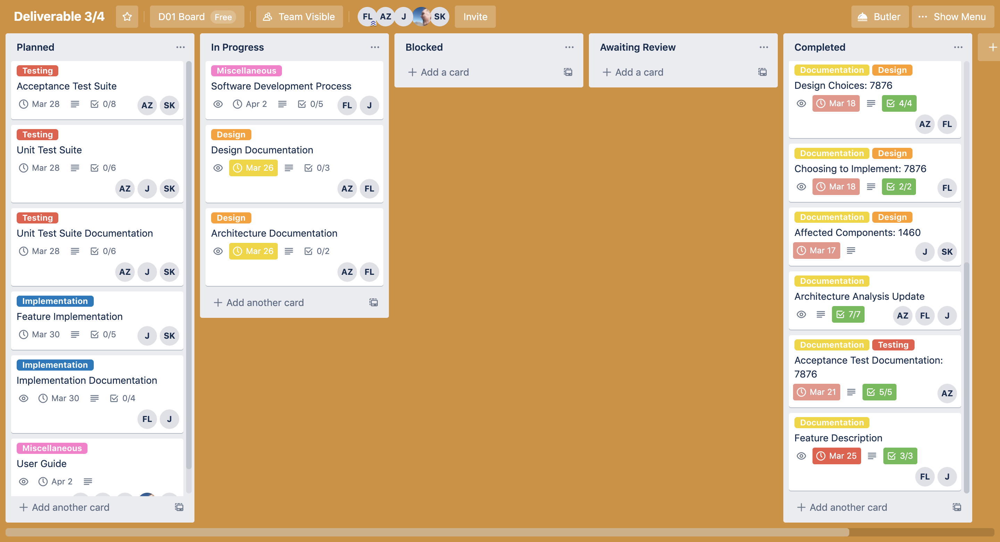

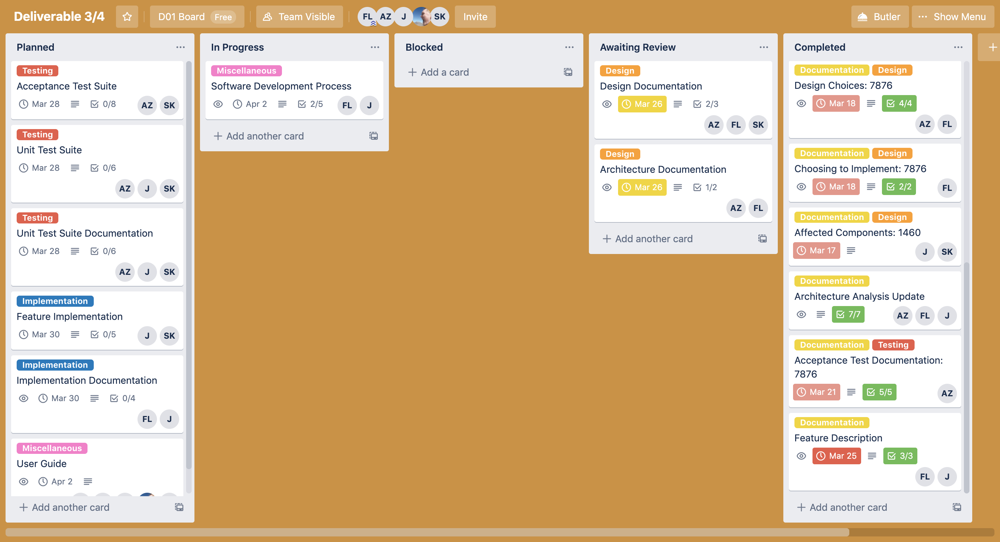

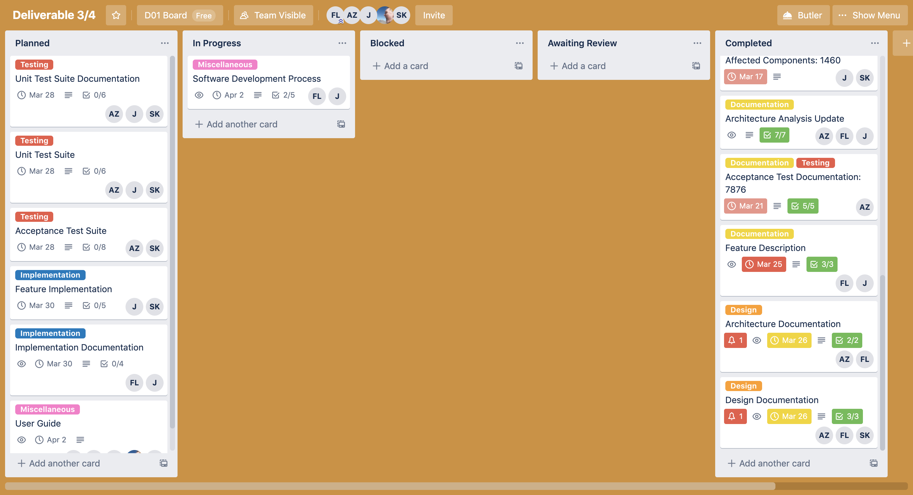

The commit marking the end of this phase was [abdf278](https://github.com/CSCD01/team_04-project/commit/abdf278ad10a9fc8b0ab0c927cf8bb9cc8a8f58a). The state of the deliverable at the end of this phase can be found [here](https://github.com/CSCD01/team_04-project/blob/abdf278ad10a9fc8b0ab0c927cf8bb9cc8a8f58a/deliverable/4/deliverable_4.md).

## Testing

During the Testing phase, we develop both Unit Tests, and Acceptance Tests. We carefully design **Unit Tests** so that each unit test is responsible for testing one core part of the feature. We distinguished three core parts, thus resulting in three unit tests. These unit tests were added to [`test_axes.py`](https://github.com/CSCD01-team04/matplotlib/blob/3205ff797038fb4662b843faceeaaec1f63acef9/lib/matplotlib/tests/test_axes.py).

We created **Acceptance Tests** which are more of a visual test, so that the user is able to notice right away that they are looking at an `inf` or `nan` errorbar. We plotted different varieties and scenarios of the new representations we added. We also tested for backwards compatibility. 

**Some Notes:** During the Testing phase, we encountered some erroneous descriptions in the Design documentation, and have updated our Design Choices appropriately. As part of the process, we had to revise some of the tests if necessary. Fortunately, it wasn't.

Since we are using a test driven development process, all the tests we have newly created are failing, before the implementation of the feature.

The commit marking the start of this phase was [2e32de1](https://github.com/CSCD01/team_04-project/commit/2e32de16f880bc5c8d96130b712f70641027a15f). The state of the deliverable at the start of this phase can be found [here](https://github.com/CSCD01/team_04-project/blob/2e32de16f880bc5c8d96130b712f70641027a15f/deliverable/4/deliverable_4.md).

Here are some snapshots of the Trello board throughout the **Testing** phase.

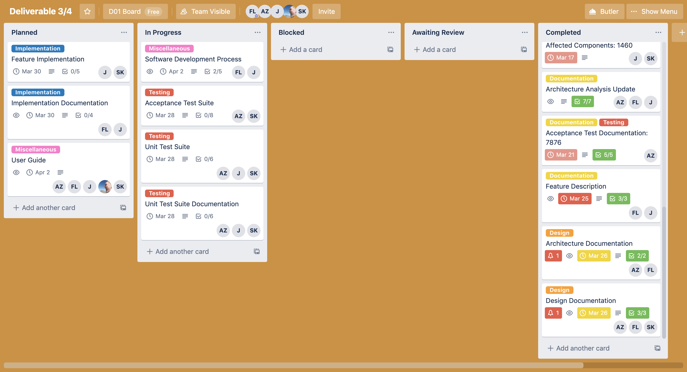

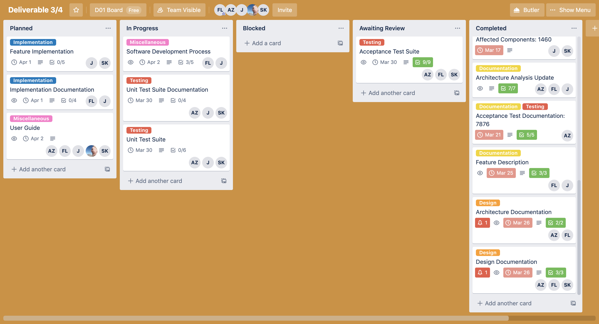

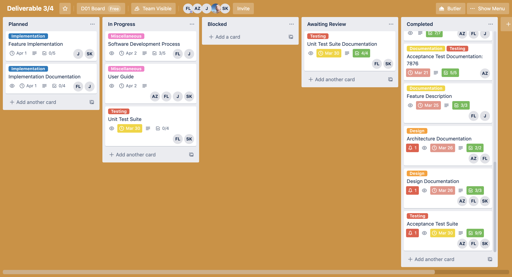

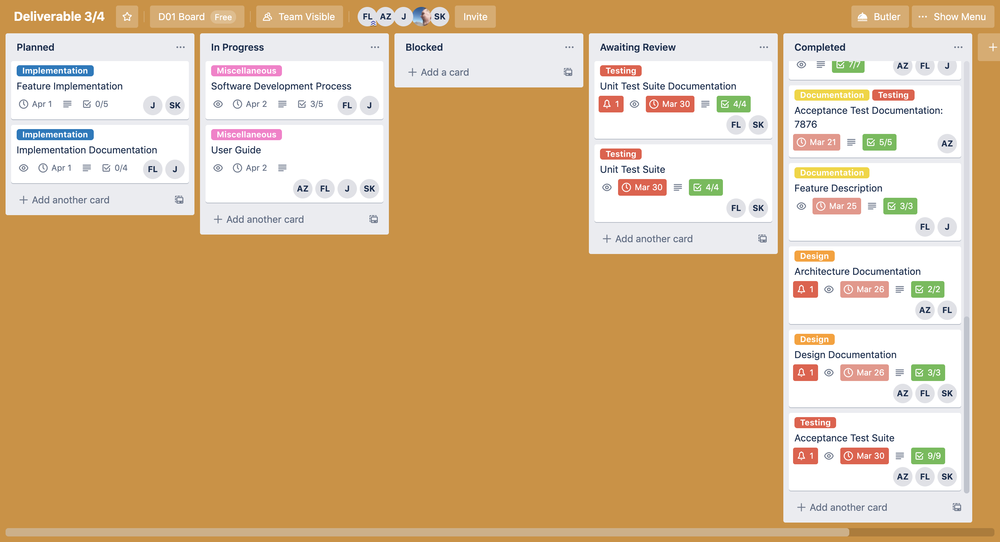

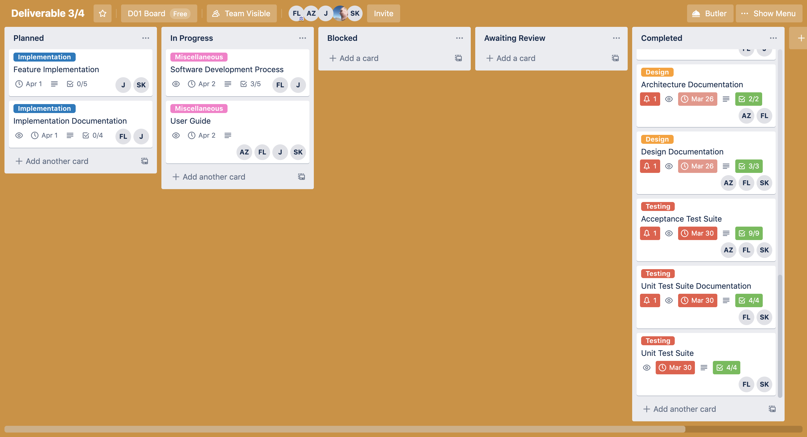

The commit marking the end of this phase was [6958110](https://github.com/CSCD01/team_04-project/commit/69581105ef178a045215e085179b0e0b72e9c9cd). The state of the deliverable at the end of this phase can be found [here](https://github.com/CSCD01/team_04-project/blob/69581105ef178a045215e085179b0e0b72e9c9cd/deliverable/4/deliverable_4.md).

## Implementation Phase

During the Implementation phase, we develop the feature in the source code. We adhere to the coding standards of matplotlib, ensuring that we follow the code style requirements (PEP 8), and that we have included docstrings describing any new functionality we have. The implementation was added to [`_axes.py`](https://github.com/CSCD01-team04/matplotlib/blob/deliverable_4_7876/lib/matplotlib/axes/_axes.py).

We have detailed how we implemented our feature in **Code Changes**, which describes where the code changes were made. We have added new private helper methods and have described those as well.

**Some Notes**: During the Implementation phase, we had to move back and forth between the Testing phase, specifically to update the unit tests. The ideas around the unit tests remained the same, but the tests were not examining the affected components properly. As we updated the unit tests, the implementation would fail those tests again and we would have to update our code.

The commit marking the start of this phase was [b79c0d9](https://github.com/CSCD01/team_04-project/commit/b79c0d9944fb7692e85efbf3c0b7c2d324884d4e). The state of the deliverable at the end of this phase can be found [here](https://github.com/CSCD01/team_04-project/blob/b79c0d9944fb7692e85efbf3c0b7c2d324884d4e/deliverable/4/deliverable_4.md).

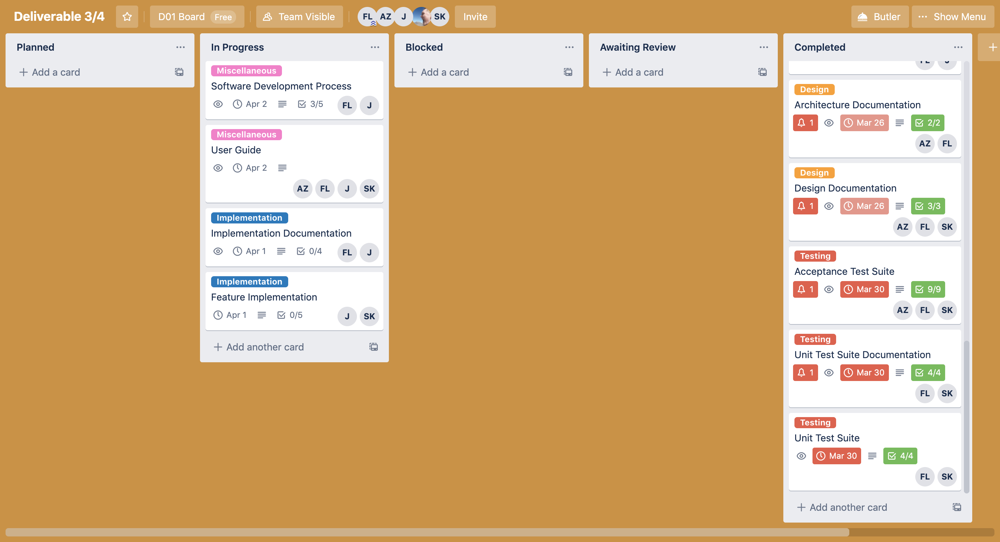

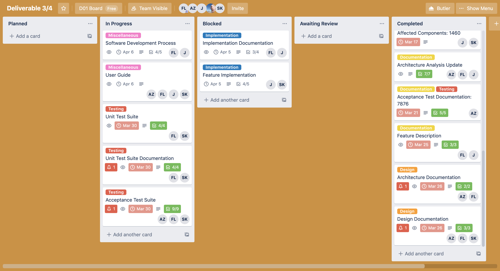

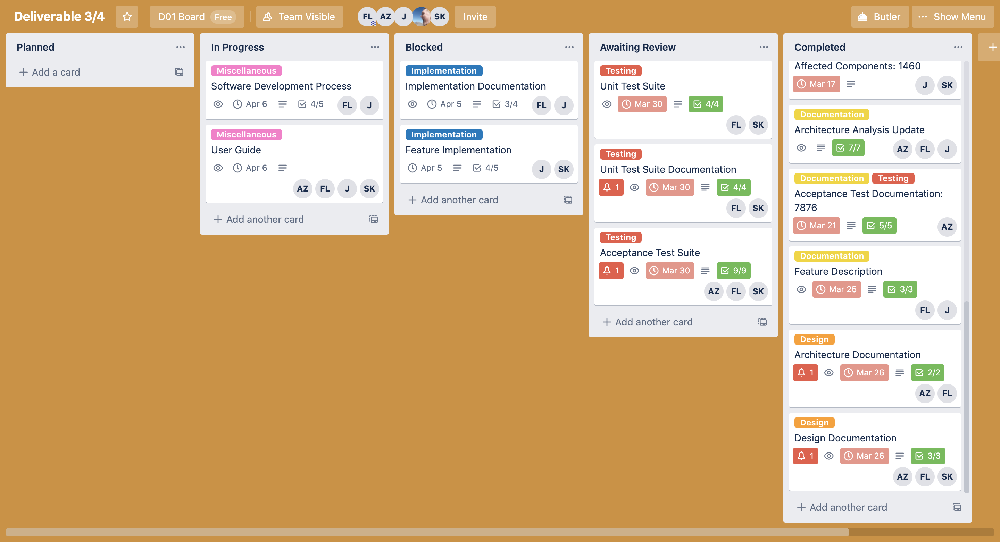

The commit marking the end of the second Testing phase was [a70531a](https://github.com/CSCD01/team_04-project/commit/a70531a810337f6e7d6859120476c73867c86a78). The state of the deliverable at the end of the second Testing phase can be found [here](https://github.com/CSCD01/team_04-project/blob/a70531a810337f6e7d6859120476c73867c86a78/deliverable/4/deliverable_4.md)

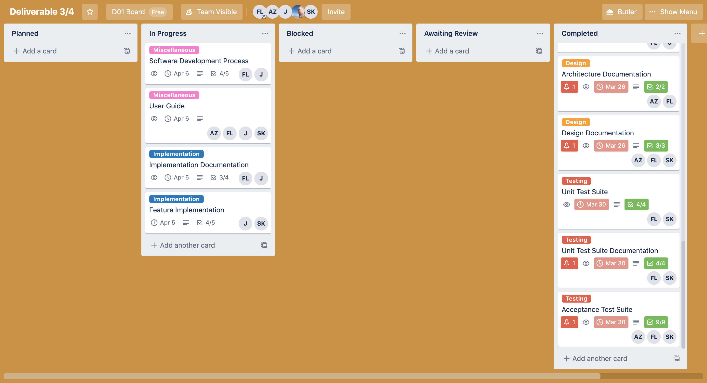

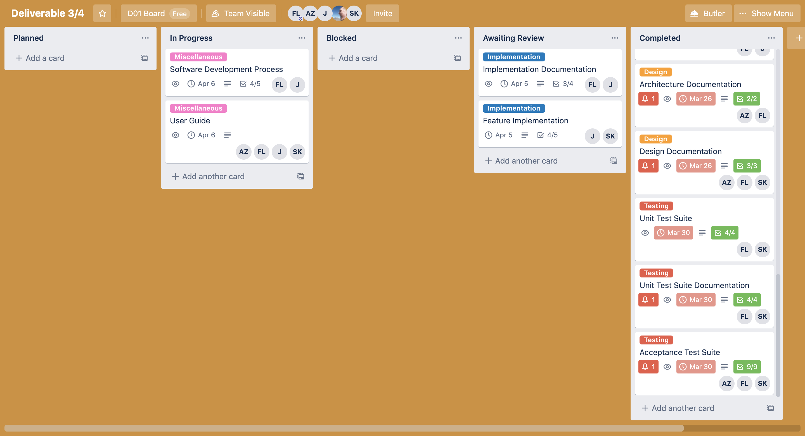

The commit marking the start of this phase (Implementation) was [58dfc2b](https://github.com/CSCD01/team_04-project/commit/58dfc2be9fb6d8f6b6c68fb75e9283ada61ab386). The state of the deliverable at the end of this phase can be found [here](https://github.com/CSCD01/team_04-project/blob/58dfc2be9fb6d8f6b6c68fb75e9283ada61ab386/deliverable/4/deliverable_4.md).

