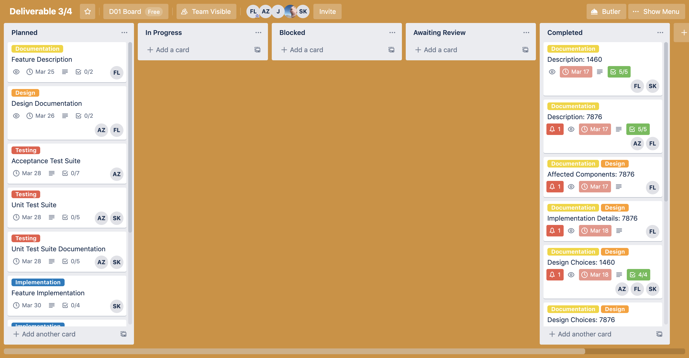
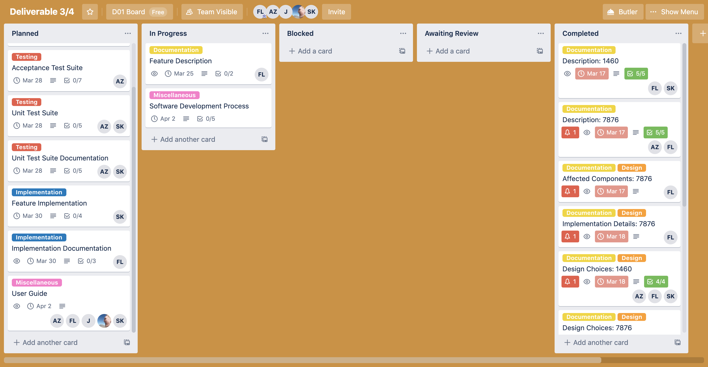
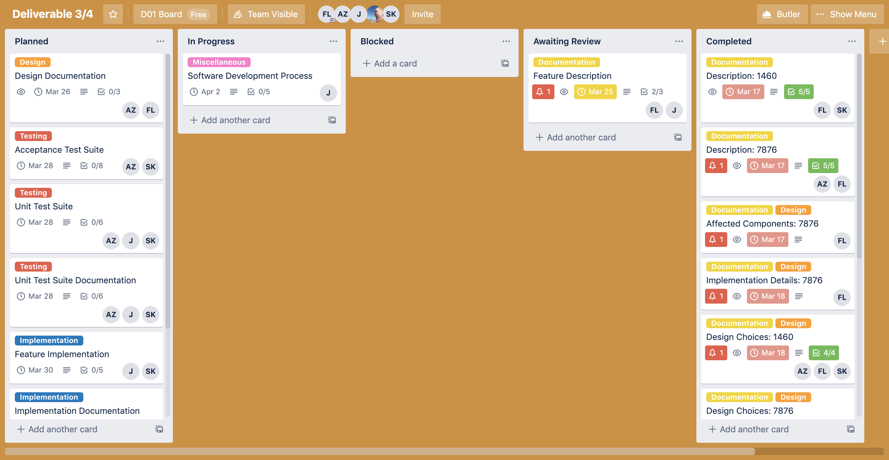

# Software Development Process

We have followed the TDD (Test Driven Development) Waterfall process that we first described in [Deliverable 1](../1/process.md) for this deliverable. This process consists of four phases.
1. **Requirements Gathering**
2. **Design** 
3. **Test Development**
4. **Implementation**

Normally, Requirements Gathering would be the longest phase. However, we have already done a bulk of this work in Deliverable 3. We were fortunate to not require extensive updates on documentation.

This deliverable is different that Deliverable 2, where we had to keep track of 5 small bugs/features. Testing and Implementation should hold the majority of our work, as well as documenting the changes we made. 

We used a [Trello board](https://trello.com/b/KEeCMz3y/deliverable-3-4) to keep track of the tasks for this deliverable. Note that this Trello board is private and can be viewed by invitation. We had five types of tasks: **Documentation** (corresponding to **Requirements Gathering**), **Design**, **Testing**, **Implementation**, and **Miscellaneous** (corresponding to "maintenance" tasks that don't fit in our process).

## Requirements Gathering

For this phase, we wanted to distinguish the original problem which the feature is based on. We see that features are based on existing problems, so it's important to:

1. Figure out what the problem is.
2. Why it is a problem: is it an issue with usability, efficiency, or otherwise?

Once we know of the problem, then we need to assess where in the code the problem is originating from. For this phase, we also described the components affected by this feature, and the specific locations in code.

Overall, in this phase we discussed the **Description** of the feature, and the problem it is trying to solve. We also discussed the **Affected Components and Location in Code**.

The commit marking the start of this phase was [64b77bb](https://github.com/CSCD01/team_04-project/commit/64b77bbcb2a91a07fa1435f702a6083678799d41). The state of the deliverable at the start of this phase can be found [here](https://github.com/CSCD01/team_04-project/blob/64b77bbcb2a91a07fa1435f702a6083678799d41/deliverable/4/deliverable_4.md).

Here are some snapshots of the Trello board throughout the **Requirements Gathering** phase.

The commit marking the end of this phase was [751991a](https://github.com/CSCD01/team_04-project/commit/751991aaf324c8e9755c242efc21692953e5f7de). The state of the deliverable at the end of this phase can be found [here](https://github.com/CSCD01/team_04-project/blob/751991aaf324c8e9755c242efc21692953e5f7de/deliverable/4/deliverable_4.md).
